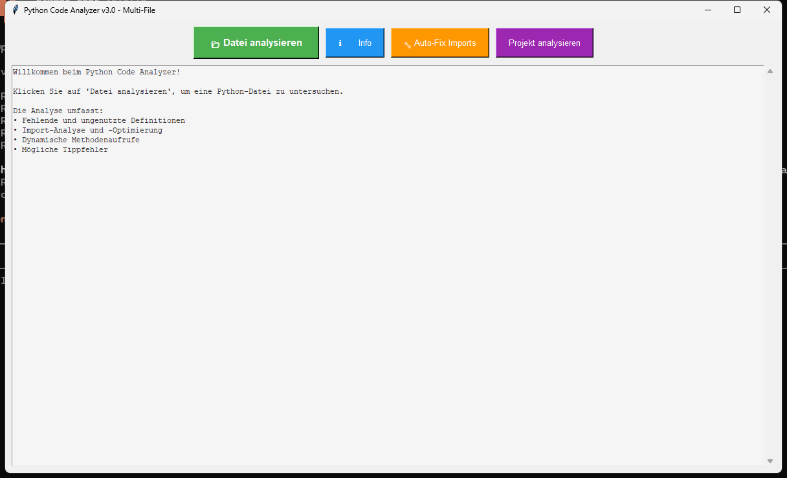

<p align="center">
  
  
  
  
  
</p>

<h1 align="center">MethodenAnalyser</h1>

<h4 align="center">Static Python code analyzer with a local Tkinter GUI: detects unused imports, dead definitions, and similar code blocks using AST analysis.</h4>

<p align="center">
  <b>English</b> | <a href="README_de.md">Deutsch</a>
</p>

---

## Features

| Feature | Description |
|---------|-------------|
| **AST Analysis** | Precise analysis powered by the Python Abstract Syntax Tree (AST) |
| **Import Tracking** | Detects used, unused, and duplicate imports |
| **Method Catalog** | Lists all functions, methods, and classes in a structured layout |
| **Duplicate Detection** | Finds similar code blocks with a configurable similarity threshold |
| **Framework Awareness** | Recognizes implicit usage in Tkinter, requests, asyncio, and other frameworks |
| **Callback Detection** | Correctly identifies callback functions as actively used |
| **Multi-File Scan** | Recursively analyzes entire Python projects |
| **Desktop GUI** | Clean Tkinter-based user interface; no terminal required for basic usage |

### How does MethodenAnalyser compare to pylint, flake8, vulture, and radon?

| Feature | MethodenAnalyser | pylint | flake8 | vulture | radon |
|---------|:---:|:---:|:---:|:---:|:---:|
| Unused Imports | **yes** | yes | partial | yes | no |
| Unused Definitions | **yes** | partial | no | yes | no |
| **Code Similarity** | **yes** | no | no | no | no |
| **Framework Awareness** | **yes** | partial | no | no | no |
| **GUI Interface** | **yes** | no | no | no | no |
| **Callback Recognition** | **yes** | no | no | partial | no |
| Zero Installation (Portable) | **yes** | no | no | no | no |

---

## Screenshot



*The desktop user interface displaying file-based analysis results and structural metrics.*

---

## Installation

MethodenAnalyser requires no external runtime dependencies. Only a Python 3.10+ environment is needed.

```bash
git clone https://github.com/dev-bricks/MethodenAnalyser.git
cd MethodenAnalyser
python MethodenAnalyser3.py
```

On Windows, you can also start the tool by double-clicking `START.bat`.

---

## Usage

### 1. Analyze a Single File via GUI
1. Launch the tool: `python MethodenAnalyser3.py` or double-click `START.bat`.
2. Click **Analyze File** (Datei analysieren) and select a `.py` file.
3. Review the findings in the output text area.

### 2. Analyze a Project via GUI
1. Click **Analyze Project** (Projekt analysieren) and select a folder.
2. The tool recursively scans all `.py` files inside the directory.
3. An aggregated project report is compiled and displayed.

### 3. CLI Mode for Automations & CI/CD
MethodenAnalyser can also run completely headless for terminal integration or CI pipelines:

```bash
# Analyze a single file
python MethodenAnalyser3.py --file path/to/file.py

# Analyze an entire project folder
python MethodenAnalyser3.py --project path/to/project

# Analyze a file and export findings to JSON
python MethodenAnalyser3.py --file path/to/file.py --json-output

# Analyze via stdin and pipe output to a JSON file
type path\to\file.py | python MethodenAnalyser3.py --stdin --json-output snippet.json
```

The `--json-output` flag exports a machine-readable report named `methodenanalyser-report-v1.json` (or a custom name if specified). Its structure is documented in [EXPORTFORMAT.md](EXPORTFORMAT.md).

### 4. Local Web Companion & PWA
For browser-based code snippets, file uploads, or analyzing small ZIP archives, you can launch the optional local web helper:

```bash
python webapp/server.py
```

Or double-click `START_WEBAPP.bat` on Windows. The server runs at `http://127.0.0.1:8765/` by default and utilizes the same AST analysis engine. 
*   **PWA Support:** It acts as a Progressive Web App (PWA) with offline capabilities (service worker) and local browser draft saving.
*   **Report Import:** You can import existing `methodenanalyser-report-v1.json` files to view them in the browser.
*   **LAN Access:** For cross-device testing (e.g. previewing on mobile devices), make the server listen on your local network:
    ```bash
    python webapp/server.py --host 0.0.0.0 --port 8765
    ```
    For further details, consult [WEBAPP.md](WEBAPP.md).

### 5. macOS and Linux Source Verification
While the GUI is optimized for Windows (using Tkinter), the codebase is fully verified to run from source on macOS and Linux. You can run unit tests and compile checks with:

```bash
python -m py_compile MethodenAnalyser3.py manage_translations.py translator.py webapp/server.py
python -m unittest discover -s tests -v
```

The repository includes a GitHub Actions workflow that executes this test suite across a matrix of Windows (Python 3.10-3.12), Ubuntu (Python 3.11), and macOS (Python 3.11).

---

## Exit Codes

For CI/CD scripts, the tool returns the following exit codes:
- `0` = Analysis succeeded, no issues/findings detected.
- `1` = Syntax, argument, or analysis error.
- `2` = Analysis succeeded, but findings (unused code, similar blocks) were detected.
- `3` = Project analysis completed, but some individual files failed to parse.

---

## Example Output

```text
=== ANALYSIS: my_script.py ===

IMPORTS (3 total):
  os        - active
  json      - active
  pathlib   - potentially unused

DEFINITIONS (5 total):
  main()
  load_config()
  old_helper() - no references found

SIMILAR CODE BLOCKS (Threshold: 80%):
  Lines 42-55 <-> Lines 88-101 (Similarity: 91%)
```

---

## Configuration

You can customize the detection parameters directly inside the source code:

```python
SIMILARITY_THRESHOLD = 0.8    # Similarity threshold (0.0 to 1.0) for duplicate detection
WINDOW_GEOMETRY = "1200x700"  # Desktop window dimensions
```

---

## Data & Privacy

MethodenAnalyser operates 100% locally. Your Python code, local file paths, and analysis results are never sent over the internet. There are no analytics, cloud integrations, telemetry features, or third-party tracking scripts.

Build, packaging, and sign-related files are configured in `.gitignore` to stay outside of the version control system.

## Repository Hygiene

- GitHub Remote: `dev-bricks/MethodenAnalyser`
- Local `master` branch is synchronized with `origin/master` (`0 ahead / 0 behind`).
- Secret & Privacy Scans: verified to have no API keys, private tokens, or credentials in tracked files.
- Before committing: run `git status --short`, execute a secret scan, and verify local compilation using `python -m py_compile MethodenAnalyser3.py manage_translations.py translator.py`.

---

## Development & Testing

```bash
# Verify Python syntax and AST compilation
python -m py_compile MethodenAnalyser3.py manage_translations.py translator.py webapp/server.py

# Run unit tests
python -m unittest discover -s tests -v
```

GitHub Actions runs these smoke tests on every push. For LLM agents and crawlers, a lightweight machine-readable context file is provided in [llms.txt](llms.txt).

---

## License

This project is licensed under the [MIT License](LICENSE).

---

## Liability / Haftung

This project is a gratuitous open-source donation ("unentgeltliche Open-Source-Schenkung" under German Civil Code §§ 516 ff. BGB). Under German law (**§ 521 BGB**), liability is limited to intent and gross negligence. The standard MIT License disclaimer applies globally.

Use at your own risk. No support guarantees, no warranty for fitness for a particular purpose or error-free operation.
