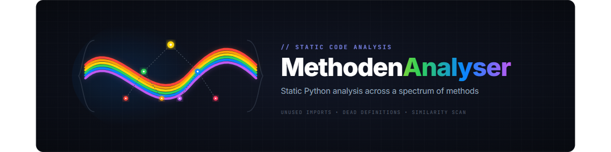
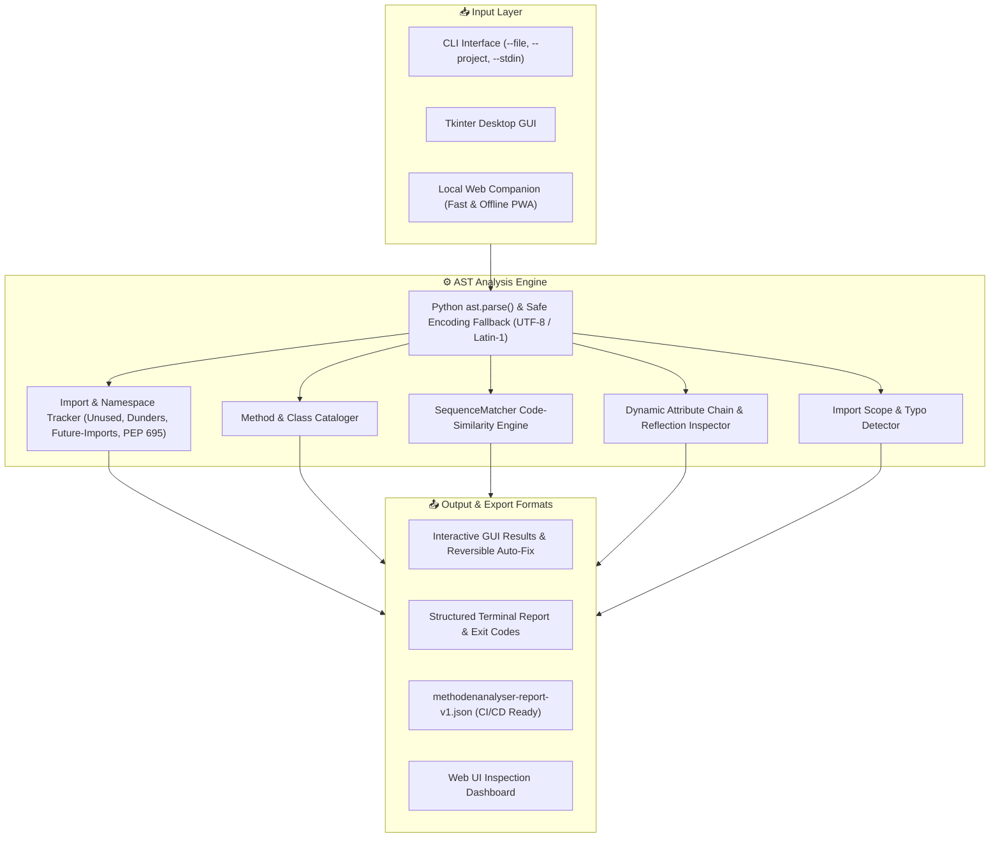
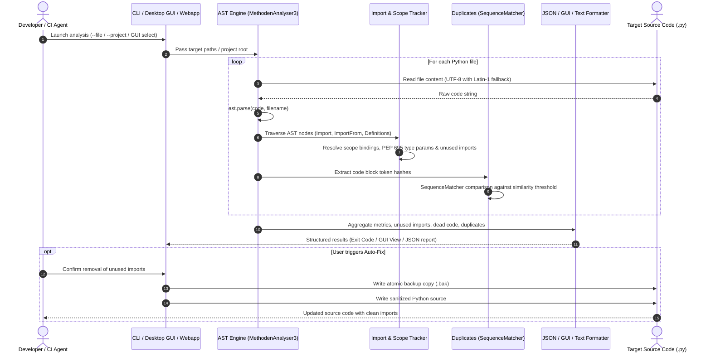

<p align="center">
  
</p>

<p align="center">
  <a href="https://github.com/dev-bricks/MethodenAnalyser/releases/tag/v3.0.2"></a>
  <a href="https://github.com/dev-bricks/MethodenAnalyser/actions/workflows/tests.yml"></a>
  <a href="#development--testing"></a>
  
  
  
  
  
  <a href="SECURITY.md"></a>
  <a href="https://github.com/astral-sh/ruff"></a>
  <a href="LICENSE"></a>
  <a href="https://github.com/dev-bricks"></a>
  <a href="https://github.com/open-bricks/open-bricks"></a>
  <a href="llms.txt"></a>
</p>

<h1 align="center">MethodenAnalyser</h1>

<h4 align="center">Static Python code analyzer with a local Tkinter GUI: detects unused imports, dead definitions, and similar code blocks using AST analysis.</h4>

<p align="center">
  <b>English</b> | <a href="README_de.md">Deutsch</a>
</p>

<p align="center">
  <a href="#features">Features</a> •
  <a href="#comparison-with-existing-tools">Comparison</a> •
  <a href="#architecture--analysis-flow">Architecture</a> •
  <a href="#end-to-end-analysis-lifecycle">Lifecycle</a> •
  <a href="#governance--runtime-invariants">Governance Invariants</a> •
  <a href="#screenshot">Screenshot</a> •
  <a href="#installation">Installation</a> •
  <a href="#usage">Usage & Workflows</a> •
  <a href="#local-web-helper-same-machine-only">Web Companion</a> •
  <a href="#exit-codes">Exit Codes</a> •
  <a href="#data--privacy">Data & Privacy</a> •
  <a href="#security-policy">Security Policy</a> •
  <a href="#ecosystem--sibling-tools">Sibling Ecosystem</a> •
  <a href="#development--testing">Development & Tests</a>
</p>

> [!TIP]
> For LLM agents, automated tools, and context-aware indexing, a canonical RAG index is provided at [llms.txt](llms.txt).

---

## Features

| Feature | Description |
|---------|-------------|
| **AST Analysis** | Precise static code analysis powered purely by Python's Abstract Syntax Tree (`ast`) |
| **Import Tracking** | Detects active, unused, duplicate, relative, and scope-bound imports with PEP 695 support |
| **Method Catalog** | Lists all functions, methods, async routines, and classes in a structured hierarchical layout |
| **Duplicate Detection** | Finds similar code blocks using Python's `difflib.SequenceMatcher` with a configurable threshold |
| **Framework Awareness** | Recognizes implicit registrations in Tkinter, PyQt, requests, asyncio, Flask, and standard event loops |
| **Callback Recognition** | Accurately identifies callback functions and GUI command bindings as actively used |
| **Multi-File Scan** | Recursively analyzes entire Python repositories and multi-package trees |
| **Desktop GUI** | Clean, accessible Tkinter desktop interface with live status bar, accessible tooltips, and shortcuts |
| **Reversible Auto-Fix** | Automatically cleans unused imports with explicit user confirmation and atomic `.bak` backups |
| **Multi-Language UI** | Native support for 6 languages (`de`, `en`, `es`, `zh`, `ja`, `ru`) in GUI, CLI, and Web helper |
| **Zero Dependencies** | Built 100% on the Python Standard Library; requires zero external packages at runtime |

---

## Comparison with Existing Tools

### How does MethodenAnalyser compare to pylint, flake8, vulture, and radon?

| Feature | MethodenAnalyser | pylint | flake8 | vulture | radon |
|---------|:---:|:---:|:---:|:---:|:---:|
| **Unused Imports** | **Yes** | Yes | Partial | Yes | No |
| **Unused Definitions** | **Yes** | Partial | No | Yes | No |
| **Code Similarity Detection** | **Yes** | No | No | No | No |
| **Framework Awareness** | **Yes** | Partial | No | No | No |
| **Desktop GUI Interface** | **Yes** | No | No | No | No |
| **Callback Recognition** | **Yes** | No | No | Partial | No |
| **Zero Installation (Portable)** | **Yes** | No | No | No | No |
| **100% Offline / Zero-Egress** | **Yes** | Yes | Yes | Yes | Yes |

---

## Screenshot


*The desktop user interface displaying file-based analysis results and structural metrics.*

---

## Architecture & Analysis Flow



---

## End-to-End Analysis Lifecycle



---

## Governance & Runtime Invariants

MethodenAnalyser enforces 10 strict architectural, runtime, and security invariants:

| Invariant | Title | Specification & Enforcement |
|---|---|---|
| **INV-LOCAL-01** | 100% Local-First & Zero-Egress | Zero outbound network calls, telemetry, analytics, or background phoning home. Source code and analysis metrics never leave the workstation. |
| **INV-SECURITY-02** | Non-Elevation / RunAsInvoker | Runs entirely in standard unprivileged user space. Never requires or requests administrative, root, or elevated privileges. |
| **INV-AST-03** | Inert Static AST Parsing | Analyzes code exclusively via Python's standard `ast.parse()`. Target files and module names are never dynamically imported (`__import__` / `exec`). |
| **INV-ENCODING-04** | Lossless Multi-Encoding Resilience | Default UTF-8 reading with automatic Latin-1 fallback. Never corrupts original character encodings, UTF-8 BOMs, or German umlauts. |
| **INV-ISOLATION-05** | Loopback Web Companion Isolation | Local helper companion binds strictly to `127.0.0.1` by default. Deliberate `--host 0.0.0.0` LAN test mode requires explicit user configuration. |
| **INV-TRAVERSAL-06** | Anti-Path-Traversal & ZIP Safety | Web companion rejects path traversal (`..`), bounds member counts, and enforces maximum archive byte limits to prevent ZIP bombs. |
| **INV-AUTOFIX-07** | Reversible Auto-Fix with Atomic Backup | Auto-Fix operates strictly on explicit user confirmation and creates an atomic `.bak` backup file before writing modifications. |
| **INV-PLATFORM-08** | Multi-Platform Parity | 100% standard library core verified across Windows Server 2025, Ubuntu Linux, and macOS 26. |
| **INV-SYNC-09** | Cloud-Sync & Multi-Agent Lock Safety | Fails closed on lock detection (`LOCK.*`), ignores cloud sync conflict files (`*-conflict-*`), preventing concurrency races. |
| **INV-SLA-10** | 48h Security SLA & 5-Day Triage | Strict vulnerability commitment: 48-hour initial response SLA and 5-business-day triage commitment with coordinated disclosure. |

---

## Installation

MethodenAnalyser requires no external runtime dependencies. Only a Python 3.10+ environment is needed.

```bash
git clone https://github.com/dev-bricks/MethodenAnalyser.git
cd MethodenAnalyser
python MethodenAnalyser3.py
```

On Windows, you can also start the tool by double-clicking `START.bat`.

Runtime uses only the Python standard library. For tests and EXE builds install
the bounded development toolchain from [requirements-dev.txt](requirements-dev.txt);
the commands and build boundary are documented in [BUILD.md](BUILD.md).

---

## Usage

### 1. Analyze a Single File via GUI
1. Launch the tool: `python MethodenAnalyser3.py` or double-click `START.bat`.
2. Click **Analyze File** (Datei analysieren) and select a `.py` file.
3. Review the findings in the output text area.

### 2. Analyze a Project via GUI
1. Click **Analyze Project** (Projekt analysieren) and select a folder.
2. The tool recursively scans all `.py` files inside the directory.
3. An aggregated project report is compiled and displayed.

### 3. CLI Mode for Automations & CI/CD
MethodenAnalyser can also run completely headless for terminal integration or CI pipelines:

```bash
# Analyze a single file
python MethodenAnalyser3.py --file path/to/file.py

# Analyze an entire project folder
python MethodenAnalyser3.py --project path/to/project

# Analyze a file and export findings to JSON
python MethodenAnalyser3.py --file path/to/file.py --json-output

# Analyze via stdin and pipe output to a JSON file
type path\to\file.py | python MethodenAnalyser3.py --stdin --json-output snippet.json

# Render CLI help and text reports in English (de, en, es, zh, ja, ru)
python MethodenAnalyser3.py --lang en --file path/to/file.py
```

The `--json-output` flag exports a machine-readable report named `methodenanalyser-report-v1.json` (or a custom name if specified). Its structure is documented in [EXPORTFORMAT.md](EXPORTFORMAT.md).

The local `POST /api/analyze` helper accepts `source_kind` `snippet`, `file`,
and `zip`. A `project` POST is intentionally rejected; project reports are
generated by the desktop/CLI path and may be imported separately in the local
web UI. See [EXPORTFORMAT.md](EXPORTFORMAT.md) and [WEBAPP.md](WEBAPP.md) for
the source-kind matrix.

### 4. Local Web Helper (same-machine only)
For browser-based snippets, file uploads, or small ZIP archives, you can launch
the optional local helper. It is not a cloud service or a mobile product:

```bash
python webapp/server.py
```

Or double-click `START_WEBAPP.bat` on Windows. The server runs at `http://127.0.0.1:8765/` by default and utilizes the same AST analysis engine. Its visible core controls can use the shared six-language catalog; the selected language stays in the local browser profile.
*   **PWA Support:** It acts as a Progressive Web App (PWA) with offline capabilities (service worker) and local browser draft saving.
*   **Report Import:** You can import existing `methodenanalyser-report-v1.json` files to view them in the browser.
*   **LAN Access:** For cross-device testing (e.g. previewing on mobile devices), make the server listen on your local network:
    ```bash
    python webapp/server.py --host 0.0.0.0 --port 8765
    ```
    This deliberate LAN test mode uses local HTTP without authentication or TLS. Use it only on a trusted private network; it is neither a cloud service nor a mobile product line. For further details, consult [WEBAPP.md](WEBAPP.md).

### 5. macOS and Linux Source Verification
While the GUI is optimized for Windows (using Tkinter), the codebase is fully verified to run from source on macOS and Linux. You can run unit tests and compile checks with:

```bash
python -m py_compile MethodenAnalyser3.py manage_translations.py translator.py webapp/server.py
python -m unittest discover -s tests -v
```

The repository includes a GitHub Actions workflow that executes this test suite across a matrix of Windows Server 2025 with Visual Studio 2026 (Python 3.10-3.13), Ubuntu (Python 3.11, 3.13), and macOS 26 (Python 3.11, 3.13).

---

## Exit Codes

For CI/CD scripts, the tool returns the following exit codes:
- `0` = Analysis succeeded, no issues/findings detected.
- `1` = Syntax, argument, or analysis error.
- `2` = Analysis succeeded, but findings (unused code, similar blocks) were detected.
- `3` = Project analysis completed, but some individual files failed to parse.

---

## Example Output

```text
=== ANALYSIS: my_script.py ===

IMPORTS (3 total):
  os        - active
  json      - active
  pathlib   - potentially unused

DEFINITIONS (5 total):
  main()
  load_config()
  old_helper() - no references found

SIMILAR CODE BLOCKS (Threshold: 80%):
  Lines 42-55 <-> Lines 88-101 (Similarity: 91%)
```

---

## Configuration

You can customize the detection parameters directly inside the source code:

```python
SIMILARITY_THRESHOLD = 0.8    # Similarity threshold (0.0 to 1.0) for duplicate detection
WINDOW_GEOMETRY = "1200x700"  # Desktop window dimensions
```

---

## Data & Privacy

MethodenAnalyser operates 100% locally. Your Python code, local file paths, and analysis results are never sent over the internet. There are no analytics, cloud integrations, telemetry features, or third-party tracking scripts. The optional web helper binds to `127.0.0.1` by default. Its explicit `--host 0.0.0.0` LAN test mode has no authentication or TLS and must be used only in a trusted private network.

Build, packaging, and sign-related files are configured in `.gitignore` to stay outside of the version control system.

---

## Security Policy

Security and data sovereignty are top priorities for the dev-bricks ecosystem.
- **Local-First Guarantee**: 100% offline analysis with zero network telemetry.
- **Inert Static Execution**: Inspected files are never executed or dynamically imported.
- **Response SLA**: Initial acknowledgement within **48 hours**; triage and severity assessment within **5 business days**.
- **Reporting Channels**:
  - GitHub Advisory: [Report a private vulnerability](https://github.com/dev-bricks/MethodenAnalyser/security/advisories/new)
  - Security Email: [security@open-bricks.org](mailto:security@open-bricks.org)
  - Ecosystem Security: [security@ellmos.ai](mailto:security@ellmos.ai)
  - Maintainer: [support@lukasgeiger.com](mailto:support@lukasgeiger.com)

See the full [SECURITY.md](SECURITY.md) for detailed policies in English and German.

---

## Repository Hygiene

- GitHub Remote: `dev-bricks/MethodenAnalyser`
- The public hygiene baseline is a named commit or tag, not a permanent snapshot
  claim in this README. Before a release or handoff, run:
  `git branch --show-current`,
  `git rev-list --left-right --count master...origin/master`, and
  `git status --short --ignored`.
- The expected gate is branch `master`, `0 0` ahead/behind for the named
  baseline, and a clean tree.
- Before committing: run `git status --short`, execute a secret scan, and verify local compilation using `python -m py_compile MethodenAnalyser3.py manage_translations.py translator.py`.

---

## Development & Testing

```bash
# Verify Python syntax and AST compilation
python -m py_compile MethodenAnalyser3.py manage_translations.py translator.py webapp/server.py
python -m compileall -q .

# Run unit tests
pytest -v
```

For the reproducible pytest/PyInstaller range and the `build_exe.bat` fallback,
see [BUILD.md](BUILD.md) and [_sources/CROSSCHECK.md](_sources/CROSSCHECK.md).

GitHub Actions runs these smoke tests on every push. The runner labels are pinned to the current 2026 migration targets (`windows-2025-vs2026` and `macos-26`) so the smoke matrix validates the same images that GitHub is moving `windows-latest` and `macos-latest` toward. For LLM agents and crawlers, a lightweight machine-readable context file is provided in [llms.txt](llms.txt).

---

## Ecosystem & Sibling Tools

`MethodenAnalyser` is part of the [`dev-bricks`](https://github.com/dev-bricks) developer suite and the [`open-bricks`](https://github.com/open-bricks) umbrella of modular, offline-first utilities:

| Tool | Organization | Description |
|---|---|---|
| **[DevCenter](https://github.com/dev-bricks/DevCenter)** | `dev-bricks` | Central developer hub and automated workflow coordinator |
| **[CodeBox](https://github.com/dev-bricks/CodeBox)** | `dev-bricks` | Local-first extensible IDE with declarative plugin architecture |
| **[MethodenAnalyser](https://github.com/dev-bricks/MethodenAnalyser)** | `dev-bricks` | Static Python code and method analyzer with local GUI & CLI |
| **[CareCenter-for-Codex](https://github.com/dev-bricks/CareCenter-for-Codex)** | `dev-bricks` | System hygiene and health center for AI agent setups |
| **[app-rotator](https://github.com/dev-bricks/app-rotator)** | `dev-bricks` | Desktop focus and application rotation manager |
| **[lock-master](https://github.com/ellmos-ai/lock-master)** | `ellmos-ai` | Cross-process lock and concurrency safety system |
| **[clutch](https://github.com/ellmos-ai/clutch)** | `ellmos-ai` | Local LLM orchestration, model routing, and prompt execution |
| **[assistant-core](https://github.com/ellmos-ai/assistant-core)** | `ellmos-ai` | Thread-safe persistence and message store backbone |
| **[decision-clicker](https://github.com/ellmos-ai/decision-clicker)** | `ellmos-ai` | Local-first governance and decision ledger |
| **[policy-registry](https://github.com/ellmos-ai/policy-registry)** | `ellmos-ai` | Declarative policy enforcement and verification engine |
| **[ellmos-codecommander-mcp](https://github.com/ellmos-ai/ellmos-codecommander-mcp)** | `ellmos-ai` | MCP server for AST refactoring and code intelligence |
| **[ellmos-filecommander-mcp](https://github.com/ellmos-ai/ellmos-filecommander-mcp)** | `ellmos-ai` | MCP server for safe local file operations |
| **[ExplorerPro](https://github.com/file-bricks/ExplorerPro)** | `file-bricks` | Modern tabbed file manager with duplicate detection |
| **[ProFiler](https://github.com/file-bricks/ProFiler)** | `file-bricks` | High-performance document categorizer with PII redaction |
| **[FormularErstellen](https://github.com/doc-bricks/FormularErstellen)** | `doc-bricks` | Deterministic schema-driven form and survey creator |
| **[open-bricks](https://github.com/open-bricks/open-bricks)** | `open-bricks` | The open umbrella ecosystem coordinating local-first developer tools |

---

## License

This project is licensed under the [MIT License](LICENSE).

---

## Liability / Haftung

This project is a gratuitous open-source donation ("unentgeltliche Open-Source-Schenkung" under German Civil Code §§ 516 ff. BGB). Under German law (**§ 521 BGB**), liability is limited to intent and gross negligence. The standard MIT License disclaimer applies globally.

Use at your own risk. No support guarantees, no warranty for fitness for a particular purpose or error-free operation.
