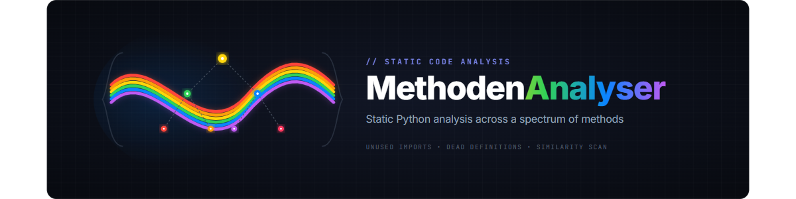
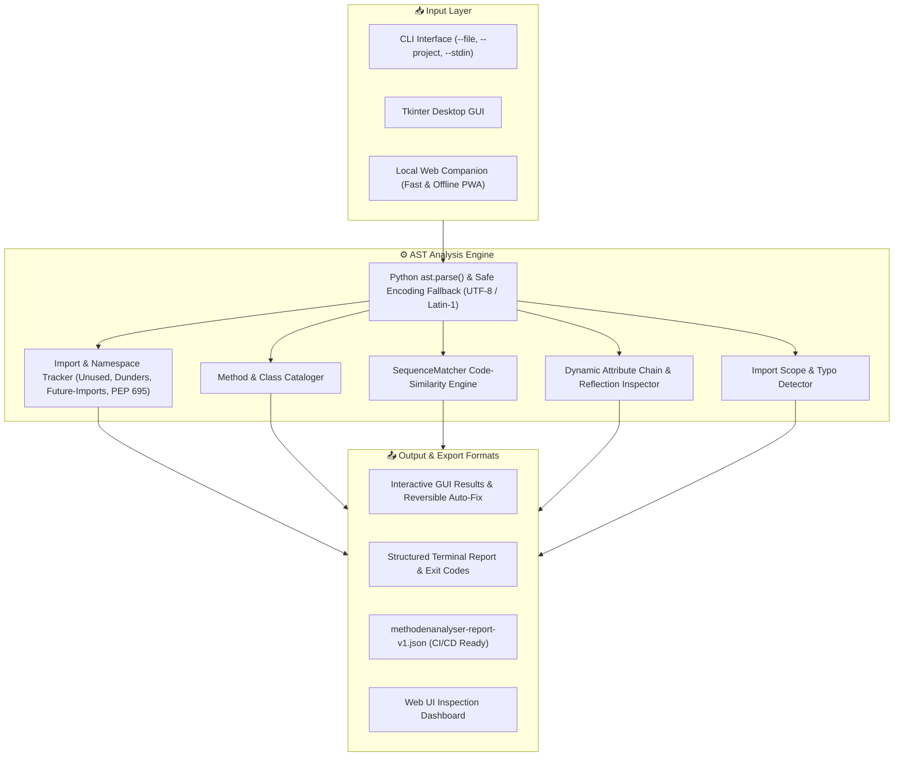
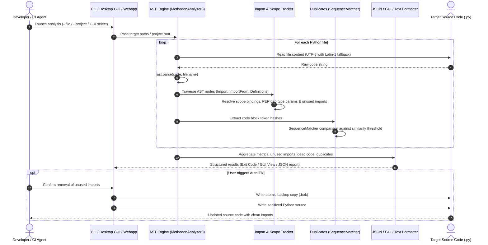

<p align="center">
  
</p>

<p align="center">
  <a href="https://github.com/dev-bricks/MethodenAnalyser/releases/tag/v3.0.2"></a>
  <a href="https://github.com/dev-bricks/MethodenAnalyser/actions/workflows/tests.yml"></a>
  <a href="#sec-13"></a>
  <a href="MARKETING-LOG.txt"></a>
  <a href="THIRD_PARTY_LICENSES.txt"></a>
  
  
  
  
  
  <a href="SECURITY.md"></a>
  <a href="#sec-17"></a>
  <a href="https://github.com/astral-sh/ruff"></a>
  <a href="LICENSE"></a>
  <a href="https://github.com/dev-bricks"></a>
  <a href="https://github.com/open-bricks/open-bricks"></a>
  <a href="llms.txt"></a>
</p>

<h1 align="center">MethodenAnalyser</h1>

<h4 align="center">Static Python code analyzer with a local Tkinter GUI: detects unused imports, dead definitions, and similar code blocks using AST analysis.</h4>

<p align="center">
  <b>English</b> | <a href="README_de.md">Deutsch</a>
</p>

---

<p align="center">
  <a href="#features">1. Features</a> •
  <a href="#architecture">2. Architecture Topology</a> •
  <a href="#target-personas">3. Personas</a> •
  <a href="#installation">4. Installation</a> •
  <a href="#screenshot">5. GUI Walkthrough</a> •
  <a href="#usage">6. Headless CLI</a> •
  <a href="#auto-fix">7. Reversible Auto-Fix</a> •
  <a href="#web-companion">8. Web Companion</a> •
  <a href="#comparison-with-existing-tools">9. Comparison</a> •
  <a href="#architecture-analysis-flow">10. Dual Mermaid</a> •
  <a href="#governance">11. Governance</a> •
  <a href="#exit-codes">12. Exit Codes</a> •
  <a href="#development--testing">13. Development & Tests</a> •
  <a href="#third-party-licenses">14. Level 1 SBOM</a> •
  <a href="#ecosystem--sibling-tools">15. Ecosystem</a> •
  <a href="#security-policy">16. Security & Privacy</a> •
  <a href="#liability--haftung">17. Statutory Notice</a> •
  <a href="#license">18. License</a>
</p>

> [!TIP]
> For LLM agents, automated tools, and context-aware indexing, a canonical RAG index is provided at [llms.txt](llms.txt).

---

### Quick Navigation

1. [Value Proposition & Features](#sec-01) · 2. [Four-View Architectural Topology](#sec-02) · 3. [Target Personas & Discoverability](#sec-03) · 4. [Installation & Quickstart](#sec-04) · 5. [Desktop GUI & Workflow Walkthrough](#sec-05) · 6. [Headless CLI & Automation](#sec-06) · 7. [Reversible Auto-Fix & Backup Lifecycle](#sec-07) · 8. [Local Web Companion & PWA Helper](#sec-08) · 9. [10-Dimension Comparative Matrix](#sec-09) · 10. [Dual Mermaid Diagrams](#sec-10) · 11. [Governance & 10 Runtime Invariants](#sec-11) · 12. [Exit Codes & JSON Schema](#sec-12) · 13. [Testing, Verification & CI Hardening](#sec-13) · 14. [Level 1 SBOM & Third-Party Licenses](#sec-14) · 15. [Sibling Ecosystem & Partner Matrix](#sec-15) · 16. [Security Policy & Zero-Egress](#sec-16) · 17. [Statutory Notice (§ 521 BGB)](#sec-17) · 18. [License & Open-Source Umbrella](#sec-18)

---

<a id="sec-01"></a>
<a id="1-value-proposition--features"></a>
<a id="1-value-proposition"></a>
<a id="value-proposition"></a>
<a id="1-features"></a>
<a id="features"></a>
<a id="1-kernnutzen--funktionen"></a>
<a id="1-kernnutzen"></a>
<a id="kernnutzen"></a>
<a id="1-funktionen"></a>
<a id="funktionen"></a>
## 1. Value Proposition & Features

MethodenAnalyser provides instant, zero-setup static Python code intelligence. Built 100% on Python's Abstract Syntax Tree (`ast`), it inspects files and multi-package trees for unused imports, unreferenced functions, duplicate blocks, and structural metrics—completely offline and without third-party runtime dependencies.

| Feature | Description |
|---------|-------------|
| **AST Analysis** | Precise static code analysis powered purely by Python's Abstract Syntax Tree (`ast.parse`) |
| **Import Tracking** | Detects active, unused, duplicate, relative, and scope-bound imports with PEP 695 type alias support |
| **Method Catalog** | Lists all functions, methods, async routines, and classes in a structured hierarchical layout |
| **Duplicate Detection** | Finds similar code blocks using Python's `difflib.SequenceMatcher` with a configurable threshold |
| **Framework Awareness** | Recognizes implicit registrations in Tkinter, PyQt, requests, asyncio, Flask, and standard event loops |
| **Callback Recognition** | Accurately identifies callback functions and GUI command bindings as actively used |
| **Multi-File Scan** | Recursively analyzes entire Python repositories and multi-package trees |
| **Desktop GUI** | Clean, accessible Tkinter desktop interface with live status bar, accessible tooltips, and WCAG 2.1 AA shortcuts |
| **Reversible Auto-Fix** | Rechecks current source after confirmation and removes only approved imports that remain unused, with `.bak` backups; preserves neighboring statements and validates the resulting syntax |
| **Multi-Language UI** | Native support for 6 languages (`de`, `en`, `es`, `zh`, `ja`, `ru`) in GUI, CLI, and Web helper |
| **Zero Dependencies** | Built 100% on the Python Standard Library; requires zero external packages at runtime |

---

<a id="sec-02"></a>
<a id="2-four-view-architectural-topology--structural-model"></a>
<a id="2-four-view-architectural-topology"></a>
<a id="four-view-architectural-topology"></a>
<a id="2-architecture"></a>
<a id="architecture"></a>
<a id="architecture--analysis-flow"></a>
<a id="2-vier-sichten-architektur--strukturmodell"></a>
<a id="2-vier-sichten-architektur"></a>
<a id="vier-sichten-architektur"></a>
<a id="2-architektur"></a>
<a id="architektur"></a>
## 2. Four-View Architectural Topology & Structural Model

MethodenAnalyser follows a clear, multi-layered architectural topology where every tier projects specific invariants:

```text
+====================================================================================================================+
|                 METHODENANALYSER -- FOUR-VIEW ARCHITECTURAL TOPOLOGY (LOCAL-FIRST & ZERO-EGRESS)                   |
+====================================================================================================================+
| [VIEW 1: USER & INTERFACE ARCHITECTURE -- DESKTOP GUI, CLI & LOCAL PWA COMPANION]                                  |
|  * Interactive Desktop GUI (Tkinter): File & Project AST analysis, live metrics bar, accessible tooltips, keys     |
|  * Headless Automation CLI: Flags --file, --project, --stdin, --json-output, --lang (de, en, es, zh, ja, ru)       |
|  * Local Web Companion (PWA): Zero-CDN vanilla HTML/JS/CSS, offline Service Worker, loopback-only 127.0.0.1:8765    |
|  * Unprivileged User-Mode [INV-SECURITY-02]: Strict RunAsInvoker non-elevation, zero admin/root requirements       |
|  * Loopback Boundary [INV-ISOLATION-05]: Strict loopback binding; LAN test mode (--host 0.0.0.0) requires flag     |
+--------------------------------------------------------------------------------------------------------------------+
                                                          |
                                                          v
+--------------------------------------------------------------------------------------------------------------------+
| [VIEW 2: AST ENGINE, LEXICAL TRAVERSAL & CODE DUPLICATE DETECTOR]                                                  |
|  * Inert Static AST Parsing [INV-AST-03]: Pure ast.parse(); inspected files/modules are NEVER executed or imported|
|  * Lossless Multi-Encoding [INV-ENCODING-04]: UTF-8 primary with Latin-1 fallback; preserves UTF-8 BOM & umlauts   |
|  * Import & Scope Tracker: Scope bindings, relative imports, dunders (__all__), future-imports, PEP 695 type params|
|  * Framework Awareness: Automatically recognizes Tkinter, PyQt, requests, asyncio, Flask & event loop bindings     |
|  * Code Similarity Engine: difflib.SequenceMatcher block tokenization with configurable threshold (SIMILARITY=0.8)  |
|  * Safe ZIP Ingestion [INV-TRAVERSAL-06]: Anti-path-traversal (..), entry count limits & byte bounds on ZIP uploads|
+--------------------------------------------------------------------------------------------------------------------+
                                                          |
                                                          v
+--------------------------------------------------------------------------------------------------------------------+
| [VIEW 3: REVERSIBLE AUTO-FIX ENGINE & ATOMIC EXPORT PIPELINE]                                                      |
|  * Reversible Auto-Fix [INV-AUTOFIX-07]: Re-checks current AST, requires user confirm, generates atomic .bak/.bak.N|
|  * Atomic Flushed Writes: Flushes changes to temporary files before atomic file replacement, preventing corruption |
|  * Export Collision Guard: methodenanalyser-report-v1.json rejects target overwrite of analyzed source files       |
|  * Exclusive Publication: Multi-run project reports preserve previous outputs; hard-link checks for collision guard|
|  * Cross-Platform Parity [INV-PLATFORM-08]: 100% Python Standard Library verified on Windows, Ubuntu, macOS 26     |
+--------------------------------------------------------------------------------------------------------------------+
                                                          |
                                                          v
+--------------------------------------------------------------------------------------------------------------------+
| [VIEW 4: SECURITY, RUNASINVOKER PRIVACY PERIMETER & GOVERNANCE]                                                    |
|  * 100% Local-First & Zero Network Egress [INV-LOCAL-01]: Zero telemetry, zero external network sockets, zero CDNs |
|  * Multi-Host Lock & Sync Defense [INV-SYNC-09]: Rejects LOCK.* files (Fail-Closed); ignores cloud sync conflicts |
|  * Level 1 SBOM Text Companion: Plain-text inventory THIRD_PARTY_LICENSES.txt; 100% zero-copyleft permissive stack |
|  * Statutory Disclaimer (§ 521 BGB): Gratuitous open-source donation liability limited to intent & gross negligence|
|  * Security & Vulnerability SLA [INV-SLA-10]: Committed 48h initial response SLA & 5-day triage (security@...)    |
+====================================================================================================================+
```

---

<a id="sec-03"></a>
<a id="3-target-personas--discoverability"></a>
<a id="3-target-personas"></a>
<a id="target-personas"></a>
<a id="discoverability"></a>
<a id="3-zielgruppen--auffindbarkeit"></a>
<a id="3-zielgruppen"></a>
<a id="zielgruppen"></a>
<a id="auffindbarkeit"></a>
## 3. Target Personas & Discoverability

### Target Personas

- **[PERSONA-01] Python Refactoring Engineers & Code Quality Leads:**
  - *Context:* Developers managing large Python legacy systems or preparing major architectural overhauls.
  - *Pain Point:* Linters either overwhelm with style warnings or miss unused functions that are referenced only as string names or implicit callbacks.
  - *How MethodenAnalyser Solves It:* Precision AST analysis separating active definitions from dead code, framework-aware callback tracking, and safe, reversible import removal.

- **[PERSONA-02] Air-Gapped & Security-Sensitive Developers:**
  - *Context:* Engineers working in defense, healthcare, banking, or isolated corporate environments.
  - *Pain Point:* Cloud-based code analysis tools and heavy npm/pip dependency trees introduce massive supply-chain and data-exfiltration attack vectors.
  - *How MethodenAnalyser Solves It:* Zero external runtime dependencies (100% standard library), zero outbound network egress (`INV-LOCAL-01`), and unprivileged execution (`RunAsInvoker` / `INV-SECURITY-02`).

- **[PERSONA-03] CI/CD Automation Engineers & Toolchain Authors:**
  - *Context:* DevOps engineers building automated quality gates and pull request verification pipelines.
  - *Pain Point:* Fragile CLI tools with unpredictable exit codes and unstructured stdout reports break pipeline scripts.
  - *How MethodenAnalyser Solves It:* Headless CLI with strict, deterministic exit codes (`0`, `1`, `2`, `3`) and standardized `methodenanalyser-report-v1.json` reports with atomic publication.

- **[PERSONA-04] Educators, Students & Python Practitioners:**
  - *Context:* Instructors and learners exploring Python syntax, method structures, and code modularity.
  - *Pain Point:* Complex linters like flake8 or pylint require extensive configuration files (`.flake8`, `pylintrc`) just to produce readable summaries.
  - *How MethodenAnalyser Solves It:* One-click portable GUI with accessible shortcuts, visual method hierarchy views, duplicate block highlight, and 6-language localization.

### High-Intent Search Queries

| Language | High-Intent Search Queries |
|---|---|
| **English (EN)** | `python static code analyzer tkinter gui` · `unused imports detector python ast` · `local python code quality checker no dependencies` · `python dead code finder gui windows` · `ast-based python code analyzer portable` · `python import tracker unused definitions finder` · `code similarity detector python local` · `zero dependency python code analyzer` |
| **German (DE)** | `statischer python code analyser mit gui` · `python ungenutzte imports finden ast` · `python toter code finder offline` · `code duplikate finden python difflib` · `python quellcode qualitaetspruefung ohne dependencies` · `tkinter python methoden analysieren` · `python ast analyse tool lokal` · `reversibler python import autofix` |

---

<a id="sec-04"></a>
<a id="4-installation--quickstart"></a>
<a id="4-installation"></a>
<a id="installation"></a>
<a id="4-installation--schnellstart"></a>
<a id="4-schnellstart"></a>
<a id="schnellstart"></a>
## 4. Installation & Quickstart

MethodenAnalyser requires no external runtime dependencies. Only a standard Python 3.10+ installation is required.

```bash
# Clone the repository
git clone https://github.com/dev-bricks/MethodenAnalyser.git
cd MethodenAnalyser

# Launch the desktop application
python MethodenAnalyser3.py
```

On Windows, you can also launch the tool immediately by double-clicking `START.bat`.

Runtime uses strictly the Python Standard Library. For running automated tests or building standalone executables, development requirements are specified in [requirements-dev.txt](requirements-dev.txt); build boundaries are documented in [BUILD.md](BUILD.md).

---

<a id="sec-05"></a>
<a id="5-desktop-gui--workflow-walkthrough"></a>
<a id="5-desktop-gui"></a>
<a id="desktop-gui"></a>
<a id="screenshot"></a>
<a id="5-desktop-gui--arbeitsablaeufe"></a>
<a id="5-desktop-gui-arbeitsablaeufe"></a>
<a id="arbeitsablaeufe"></a>
## 5. Desktop GUI & Workflow Walkthrough


*The desktop user interface displaying file-based analysis results and structural metrics.*

### Desktop Workflows

1. **Analyze a Single File:**
   - Launch the application: `python MethodenAnalyser3.py` or double-click `START.bat`.
   - Click **Analyze File** (`Alt+D` / `Ctrl+O`) and choose a `.py` file.
   - Inspect active vs. unused imports, method hierarchies, and duplicate blocks.

2. **Analyze a Complete Project Folder:**
   - Click **Analyze Project** (`Alt+P` / `Ctrl+Shift+O`) and select any project directory.
   - The engine recursively traverses the tree, pruning ignored folders (`.git`, `.venv`, `node_modules`).
   - An aggregated project report with overall metrics is generated.

3. **Accessible Navigation & Shortcuts:**
   - Full WCAG 2.1 AA keyboard support: access the accessible shortcuts dialog with `F1`.
   - Context menu (`Right-Click` or `App-Key`) on the output area allows copying, saving reports, or clearing output.
   - Language switching directly via the menu bar (`&Sprache` / `&Language`).

---

<a id="sec-06"></a>
<a id="6-headless-cli--automation"></a>
<a id="6-headless-cli"></a>
<a id="cli"></a>
<a id="usage"></a>
<a id="6-headless-cli--automatisierung"></a>
<a id="6-headless-cli-automatisierung"></a>
<a id="automatisierung"></a>
<a id="bedienung"></a>
## 6. Headless CLI & Automation

MethodenAnalyser runs completely headless for terminal scripts, pre-commit hooks, and CI/CD pipelines:

```bash
# Analyze a single file in the terminal
python MethodenAnalyser3.py --file path/to/file.py

# Analyze an entire project directory recursively
python MethodenAnalyser3.py --project path/to/project

# Analyze a file and export findings to JSON
python MethodenAnalyser3.py --file path/to/file.py --json-output

# Analyze via stdin and pipe output to a JSON file
type path\to\file.py | python MethodenAnalyser3.py --stdin --json-output snippet.json

# Render CLI output in a specific language (de, en, es, zh, ja, ru)
python MethodenAnalyser3.py --lang en --file path/to/file.py
```

The `--json-output` flag exports a machine-readable report named `methodenanalyser-report-v1.json` (or a custom name). Report specifications are defined in [EXPORTFORMAT.md](EXPORTFORMAT.md). Export targets that match an analyzed source file (including symlinks and hardlinks) are strictly rejected before writing, preventing source file overwrites.

---

<a id="sec-07"></a>
<a id="7-reversible-auto-fix--backup-lifecycle"></a>
<a id="7-reversible-auto-fix"></a>
<a id="auto-fix"></a>
<a id="7-reversibler-auto-fix--backup-lebenszyklus"></a>
<a id="7-reversibler-auto-fix"></a>
<a id="backup-lebenszyklus"></a>
## 7. Reversible Auto-Fix & Backup Lifecycle

The Auto-Fix feature (`Alt+F`) safely removes unused imports from analyzed Python sources:

1. **Explicit User Confirmation:** Auto-Fix requires manual confirmation and presents a review of detected unused imports.
2. **Current AST Recheck:** The engine re-parses the source file on disk immediately prior to modification to detect any concurrent edits. If the source changed, the operation aborts safely.
3. **Byte-Exact Atomic Backup:** Creates an atomic backup (`.bak`, `.bak.1`, `.bak.2`, …) using same-directory hard links or atomic copy. Existing backups are never overwritten.
4. **Neighbor Preservation:** Preserves surrounding comments, neighboring statements on the same line, and ensures required `pass` statements remain when a block body becomes empty.
5. **Syntax Verification:** The sanitized code is verified via `ast.parse()` before writing. Only syntactically valid code is written.
6. **Atomic Replacement:** Changes are written and flushed to a temporary file, then atomically replaced to ensure file integrity. Original encoding (including UTF-8 BOM), newline conventions, and permissions are preserved.

---

<a id="sec-08"></a>
<a id="8-local-web-companion--pwa-helper"></a>
<a id="8-local-web-companion"></a>
<a id="web-companion"></a>
<a id="8-lokaler-web-begleiter--pwa"></a>
<a id="8-lokaler-web-begleiter"></a>
<a id="web-begleiter"></a>
## 8. Local Web Companion & PWA Helper

For browser-based analysis of code snippets, single files, or small ZIP archives, launch the local helper:

```bash
python webapp/server.py
```

Or double-click `START_WEBAPP.bat` on Windows. The server runs at `http://127.0.0.1:8765/` by default:

* **Pure Vanilla Architecture:** Zero external JavaScript libraries, zero npm dependencies, zero remote CDNs.
* **Offline PWA Capabilities:** Operates as a Progressive Web App (PWA) with a local service worker, client-side draft saving, and multi-resolution icons (`mobile_icons/`).
* **Strict Loopback Boundary [INV-ISOLATION-05]:** Binds strictly to `127.0.0.1`.
* **Explicit LAN Test Mode:** For previewing across local devices, start with `--host 0.0.0.0 --port 8765`. This deliberate LAN test mode uses local HTTP without authentication or TLS. Use it only on a trusted private network; it is neither a cloud service nor a mobile product line. For further details, consult [WEBAPP.md](WEBAPP.md).

---

<a id="sec-09"></a>
<a id="9-10-dimension-comparative-matrix-vs-existing-linters"></a>
<a id="9-comparative-matrix"></a>
<a id="comparative-matrix"></a>
<a id="comparison-with-existing-tools"></a>
<a id="9-10-dimensionen-vergleichsmatrix-vs-bestehende-linters"></a>
<a id="9-vergleichsmatrix"></a>
<a id="vergleichsmatrix"></a>
<a id="vergleich-mit-bestehenden-werkzeugen"></a>
## 9. 10-Dimension Comparative Matrix vs. Existing Linters

| Technical Dimension / Invariant | MethodenAnalyser (`dev-bricks`) | pylint | flake8 | vulture | radon |
|---|:---:|:---:|:---:|:---:|:---:|
| **1. Unused Import Tracking** | **Yes (PEP 695 & Scope aware)** | Yes | Partial (F401) | Yes | No |
| **2. Unused Definition & Dead Code** | **Yes (Methods, classes, async)** | Partial | No | Yes | No |
| **3. Code Similarity Detection** | **Yes (`difflib.SequenceMatcher`)** | No | No | No | No |
| **4. Framework & Callback Awareness** | **Yes (Tkinter, PyQt, Flask, etc.)** | Partial | No | Partial | No |
| **5. Interactive Desktop GUI (Tkinter)** | **Yes (Native desktop + A11y)** | No | No | No | No |
| **6. Reversible Auto-Fix with `.bak`** | **Yes (Atomic & syntax-checked)** | No | No | No | No |
| **7. Zero Runtime Dependencies (stdlib)** | **Yes (100% Python Standard Library)** | No (Many deps) | No (Many deps) | No | No |
| **8. 100% Offline / Zero-Egress** | **Yes (`INV-LOCAL-01`)** | Yes | Yes | Yes | Yes |
| **9. Native Multi-Language UI (6 langs)** | **Yes (`de`, `en`, `es`, `zh`, `ja`, `ru`)** | No | No | No | No |
| **10. RunAsInvoker Non-Elevation Guarantee** | **Yes (`INV-SECURITY-02`)** | Yes | Yes | Yes | Yes |

---

<a id="sec-10"></a>
<a id="10-dual-mermaid-diagrams-flowchart--sequence"></a>
<a id="10-dual-mermaid-diagrams"></a>
<a id="dual-mermaid-diagrams"></a>
<a id="architecture-analysis-flow"></a>
<a id="end-to-end-analysis-lifecycle"></a>
<a id="10-duale-mermaid-diagramme-flussdiagramm--sequenz"></a>
<a id="10-duale-mermaid-diagramme"></a>
<a id="duale-mermaid-diagramme"></a>
<a id="architektur-analyse-ablauf"></a>
<a id="end-to-end-analyse-lebenszyklus"></a>
## 10. Dual Mermaid Diagrams

### Architecture & Analysis Flow


```mermaid
flowchart TD
    subgraph Input["📥 Input Layer"]
        CLI["CLI Interface (--file, --project, --stdin)"]
        GUI["Tkinter Desktop GUI"]
        WebHelper["Local Web Companion (Fast & Offline PWA)"]
    end

    subgraph Core["⚙️ AST Analysis Engine"]
        Parser["Python ast.parse() & Safe Encoding Fallback (UTF-8 / Latin-1)"]
        Imports["Import & Namespace Tracker (Unused, Dunders, Future-Imports, PEP 695)"]
        Methods["Method & Class Cataloger"]
        Duplicates["SequenceMatcher Code-Similarity Engine"]
        Dynamic["Dynamic Attribute Chain & Reflection Inspector"]
        Scope["Import Scope & Typo Detector"]
    end

    subgraph Output["📤 Output & Export Formats"]
        GUISummary["Interactive GUI Results & Reversible Auto-Fix"]
        CLIText["Structured Terminal Report & Exit Codes"]
        JSONExport["methodenanalyser-report-v1.json (CI/CD Ready)"]
        BrowserUI["Web UI Inspection Dashboard"]
    end

    Input --> Parser
    Parser --> Imports & Methods & Duplicates & Dynamic & Scope
    Imports & Methods & Duplicates & Dynamic & Scope --> Output
```

### End-to-End Analysis Lifecycle


```mermaid
sequenceDiagram
    autonumber
    actor Developer as Developer / CI Agent
    participant CLI as CLI / Desktop GUI / Webapp
    participant Engine as AST Engine (MethodenAnalyser3)
    participant Tracker as Import & Scope Tracker
    participant Diff as Duplicates (SequenceMatcher)
    participant Report as JSON / GUI / Text Formatter
    actor Target as Target Source Code (.py)

    Developer->>CLI: Launch analysis (--file / --project / GUI select)
    CLI->>Engine: Pass target paths / project root
    loop For each Python file
        Engine->>Target: Read file content (UTF-8 with Latin-1 fallback)
        Target-->>Engine: Raw code string
        Engine->>Engine: ast.parse(code, filename)
        Engine->>Tracker: Traverse AST nodes (Import, ImportFrom, Definitions)
        Tracker->>Tracker: Resolve scope bindings, PEP 695 type params & unused imports
        Engine->>Diff: Extract code block token hashes
        Diff->>Diff: SequenceMatcher comparison against similarity threshold
    end
    Engine->>Report: Aggregate metrics, unused imports, dead code, duplicates
    Report-->>CLI: Structured results (Exit Code / GUI View / JSON report)
    opt User triggers Auto-Fix
        Developer->>CLI: Confirm removal of unused imports
        CLI->>Target: Write atomic backup copy (.bak)
        CLI->>Target: Write sanitized Python source
        Target-->>Developer: Updated source code with clean imports
    end
```

---

<a id="sec-11"></a>
<a id="11-governance--10-runtime-invariants"></a>
<a id="11-governance-invariants"></a>
<a id="governance-invariants"></a>
<a id="governance--runtime-invariants"></a>
<a id="governance"></a>
<a id="11-governance--und-10-laufzeit-invarianten"></a>
<a id="11-governance-und-laufzeit-invarianten"></a>
<a id="governance--und-laufzeit-invarianten"></a>
## 11. Governance & 10 Runtime Invariants

MethodenAnalyser enforces 10 strict architectural, runtime, and security invariants:

| Invariant | Title | Specification & Enforcement |
|---|---|---|
| **INV-LOCAL-01** | 100% Local-First & Zero-Egress | Zero outbound network calls, telemetry, analytics, or background phoning home. Source code and analysis metrics never leave the workstation. |
| **INV-SECURITY-02** | Non-Elevation / RunAsInvoker | Runs entirely in standard unprivileged user space. Never requires or requests administrative, root, or elevated privileges. |
| **INV-AST-03** | Inert Static AST Parsing | Analyzes code exclusively via Python's standard `ast.parse()`. Target files and module names are never dynamically imported (`__import__` / `exec`). |
| **INV-ENCODING-04** | Lossless Multi-Encoding Resilience | Default UTF-8 reading with automatic Latin-1 fallback. Never corrupts original character encodings, UTF-8 BOMs, or German umlauts. |
| **INV-ISOLATION-05** | Loopback Web Companion Isolation | Local helper companion binds strictly to `127.0.0.1` by default. Deliberate `--host 0.0.0.0` LAN test mode requires explicit user configuration. |
| **INV-TRAVERSAL-06** | Anti-Path-Traversal & ZIP Safety | Web companion rejects path traversal (`..`), bounds member counts, and enforces maximum archive byte limits to prevent ZIP bombs. |
| **INV-AUTOFIX-07** | Reversible Auto-Fix with Backup | Auto-Fix requires explicit confirmation, rechecks current source usage and publishes a byte-exact backup without replacing existing copies (`.bak`, `.bak.1`, …), then atomically replaces the source from a flushed temporary file. Detected source changes abort the write; encoding (including a UTF-8 BOM), newline style and file mode are retained. |
| **INV-PLATFORM-08** | Multi-Platform Parity | 100% standard library core verified across Windows Server 2025, Ubuntu Linux, and macOS 26. |
| **INV-SYNC-09** | Cloud-Sync & Multi-Agent Lock Safety | Fails closed on lock detection (`LOCK.*`), ignores cloud sync conflict files (`*-conflict-*`), preventing concurrency races. |
| **INV-SLA-10** | 48h Security SLA & 5-Day Triage | Strict vulnerability commitment: 48-hour initial response SLA and 5-business-day triage commitment with coordinated disclosure. |

---

<a id="sec-12"></a>
<a id="12-exit-codes--json-schema-specification"></a>
<a id="12-exit-codes"></a>
<a id="exit-codes"></a>
<a id="json-schema"></a>
<a id="12-exit-codes--json-schemaspezifikation"></a>
<a id="12-exit-codes-json-schemaspezifikation"></a>
## 12. Exit Codes & JSON Schema Specification

For CI/CD scripts and automated quality gates, the tool returns deterministic exit codes:

- `0` = Analysis succeeded, no issues or findings detected.
- `1` = Syntax error, invalid CLI arguments, or analysis abort.
- `2` = Analysis succeeded, but findings (unused imports, dead definitions, code duplicates) were detected.
- `3` = Project analysis completed, but some individual files failed to parse.

### JSON Report Format (`methodenanalyser-report-v1.json`)

```json
{
  "schema_version": "methodenanalyser-report-v1",
  "generated_at": "2026-10-08T13:45:00Z",
  "tool_version": "3.0.2",
  "summary": {
    "total_files": 12,
    "total_lines": 3450,
    "total_functions": 84,
    "total_classes": 14,
    "unused_imports_count": 3,
    "unused_definitions_count": 1,
    "duplicate_blocks_count": 0
  },
  "files": []
}
```

Full schema specifications are documented in [EXPORTFORMAT.md](EXPORTFORMAT.md).

---

<a id="sec-13"></a>
<a id="13-testing-verification--ci-hardening"></a>
<a id="13-development-testing"></a>
<a id="development--testing"></a>
<a id="development-testing"></a>
<a id="13-tests-verifikation--ci-haertung"></a>
<a id="13-entwicklung-tests"></a>
<a id="entwicklung--tests"></a>
<a id="entwicklung-tests"></a>
## 13. Testing, Verification & CI Hardening

### Repository Hygiene

- GitHub Remote: `dev-bricks/MethodenAnalyser`
- The public hygiene baseline is a named commit or tag, not a permanent snapshot claim in this README. Before a release or handoff, run:
  `git branch --show-current`,
  `git rev-list --left-right --count master...origin/master`, and
  `git status --short --ignored`.
- The expected gate is branch `master`, `0 0` ahead/behind for the named baseline, and a clean tree.
- Before committing: run `git status --short`, execute a secret scan, and verify local compilation using `python -m py_compile MethodenAnalyser3.py manage_translations.py translator.py`.

### Automated Test Suite

```bash
# Verify syntax across all modules
python -m compileall -q .

# Run static linter
ruff check .

# Execute full automated test suite
pytest -ra -v
```

GitHub Actions runs these smoke tests on every push. The runner labels are pinned to current migration targets (`windows-2025-vs2026` and `macos-26`) to validate the same images that GitHub moves `windows-latest` and `macos-latest` toward.

---

<a id="sec-14"></a>
<a id="14-level-1-sbom--third-party-licenses-companion"></a>
<a id="14-level-1-sbom"></a>
<a id="level-1-sbom"></a>
<a id="third-party-licenses"></a>
<a id="14-level-1-sbom--drittanbieter-lizenzen-companion"></a>
<a id="14-drittanbieter-lizenzen"></a>
<a id="drittanbieter-lizenzen"></a>
## 14. Level 1 SBOM & Third-Party Licenses Companion

MethodenAnalyser requires **zero external runtime packages**. All core functionality is provided directly by the Python Standard Library (`ast`, `tkinter`, `difflib`, `json`, `pathlib`, `http.server`, etc.).

A canonical Level 1 Software Bill of Materials (SBOM) companion is maintained in both plain-text and markdown:
- Plain-Text Companion: [THIRD_PARTY_LICENSES.txt](THIRD_PARTY_LICENSES.txt) (5-field schema: Package, License, SPDX, URL, Notice)
- Markdown Overview: [THIRD_PARTY_LICENSES.md](THIRD_PARTY_LICENSES.md)

---

<a id="sec-15"></a>
<a id="15-sibling-ecosystem--partner-matrix"></a>
<a id="15-sibling-ecosystem"></a>
<a id="ecosystem--sibling-tools"></a>
<a id="sibling-ecosystem"></a>
<a id="15-geschwister-oekosystem--partner-matrix"></a>
<a id="15-partner-oekosystem"></a>
<a id="oekosystem--partner-werkzeuge"></a>
<a id="ökosystem--partner-werkzeuge"></a>
## 15. Sibling Ecosystem & Partner Matrix

`MethodenAnalyser` is part of the [`dev-bricks`](https://github.com/dev-bricks) developer suite and the [`open-bricks`](https://github.com/open-bricks) umbrella of modular, offline-first utilities:

| Tool | Organization | Description |
|---|---|---|
| **[DevCenter](https://github.com/dev-bricks/DevCenter)** | `dev-bricks` | Central developer hub and automated workflow coordinator |
| **[CodeBox](https://github.com/dev-bricks/CodeBox)** | `dev-bricks` | Local-first extensible IDE with declarative plugin architecture |
| **[MethodenAnalyser](https://github.com/dev-bricks/MethodenAnalyser)** | `dev-bricks` | Static Python code and method analyzer with local GUI & CLI |
| **[CareCenter-for-Codex](https://github.com/dev-bricks/CareCenter-for-Codex)** | `dev-bricks` | System hygiene and health center for AI agent setups |
| **[app-rotator](https://github.com/dev-bricks/app-rotator)** | `dev-bricks` | Desktop focus and application rotation manager |
| **[lock-master](https://github.com/ellmos-ai/lock-master)** | `ellmos-ai` | Cross-process lock and concurrency safety system |
| **[clutch](https://github.com/ellmos-ai/clutch)** | `ellmos-ai` | Local LLM orchestration, model routing, and prompt execution |
| **[assistant-core](https://github.com/ellmos-ai/assistant-core)** | `ellmos-ai` | Thread-safe persistence and message store backbone |
| **[decision-clicker](https://github.com/ellmos-ai/decision-clicker)** | `ellmos-ai` | Local-first governance and decision ledger |
| **[policy-registry](https://github.com/ellmos-ai/policy-registry)** | `ellmos-ai` | Declarative policy enforcement and verification engine |
| **[ellmos-codecommander-mcp](https://github.com/ellmos-ai/ellmos-codecommander-mcp)** | `ellmos-ai` | MCP server for AST refactoring and code intelligence |
| **[ellmos-filecommander-mcp](https://github.com/ellmos-ai/ellmos-filecommander-mcp)** | `ellmos-ai` | MCP server for safe local file operations |
| **[ExplorerPro](https://github.com/file-bricks/ExplorerPro)** | `file-bricks` | Modern tabbed file manager with duplicate detection |
| **[ProFiler](https://github.com/file-bricks/ProFiler)** | `file-bricks` | High-performance document categorizer with PII redaction |
| **[FormularErstellen](https://github.com/doc-bricks/FormularErstellen)** | `doc-bricks` | Deterministic schema-driven form and survey creator |
| **[open-bricks](https://github.com/open-bricks/open-bricks)** | `open-bricks` | The open umbrella ecosystem coordinating local-first developer tools |

---

<a id="sec-16"></a>
<a id="16-security-policy-runasinvoker--zero-egress"></a>
<a id="16-security-policy"></a>
<a id="security-policy"></a>
<a id="data--privacy"></a>
<a id="16-sicherheitsrichtlinie-runasinvoker--zero-egress"></a>
<a id="16-sicherheitsrichtlinie"></a>
<a id="sicherheitsrichtlinie"></a>
<a id="datenschutz--lokale-integrität"></a>
<a id="datenschutz--lokale-integritaet"></a>
## 16. Security Policy, RunAsInvoker & Zero-Egress

Security and data sovereignty are foundational requirements:
- **Local-First & Zero Network Egress [INV-LOCAL-01]:** 100% offline analysis. No analytics, tracking, or network calls.
- **Unprivileged User Mode [INV-SECURITY-02]:** Runs strictly as `RunAsInvoker`. Never requires or requests administrative privileges.
- **Inert Static Execution [INV-AST-03]:** Inspected code is strictly parsed into an AST; code is never executed or dynamically imported.
- **Vulnerability Response Commitment [INV-SLA-10]:** Initial acknowledgement within **48 hours**; triage within **5 business days**.
- **Reporting Channels:**
  - GitHub Advisory: [Report a private vulnerability](https://github.com/dev-bricks/MethodenAnalyser/security/advisories/new)
  - Security Email: [security@open-bricks.org](mailto:security@open-bricks.org)
  - Ecosystem Security: [security@ellmos.ai](mailto:security@ellmos.ai)
  - Maintainer: [support@lukasgeiger.com](mailto:support@lukasgeiger.com)

See the full [SECURITY.md](SECURITY.md) for detailed policies in English and German.

---

<a id="sec-17"></a>
<a id="17-statutory-notice--521-bgb-gefaelligkeitsrecht"></a>
<a id="17-statutory-notice"></a>
<a id="liability--haftung"></a>
<a id="liability"></a>
<a id="17-gesetzlicher-hinweis--521-bgb-gefaelligkeitsrecht"></a>
<a id="17-gesetzlicher-hinweis"></a>
<a id="haftung"></a>
## 17. Statutory Notice (§ 521 BGB Gefälligkeitsrecht)

This project is a gratuitous open-source donation ("unentgeltliche Open-Source-Schenkung" under German Civil Code §§ 516 ff. BGB). Under German law (**§ 521 BGB**), liability is limited to intent and gross negligence. The standard MIT License disclaimer applies globally.

Use at your own risk. No support guarantees, no warranty for fitness for a particular purpose or error-free operation.

---

<a id="sec-18"></a>
<a id="18-license--open-source-umbrella"></a>
<a id="18-license"></a>
<a id="license"></a>
<a id="18-lizenz--open-source-dach"></a>
<a id="18-lizenz"></a>
<a id="lizenz"></a>
## 18. License & Open-Source Umbrella

This project is open-source software licensed under the [MIT License](LICENSE).

MethodenAnalyser is proudly part of the [open-bricks](https://github.com/open-bricks) umbrella initiative for modular, sovereign, and privacy-respecting software tools.
