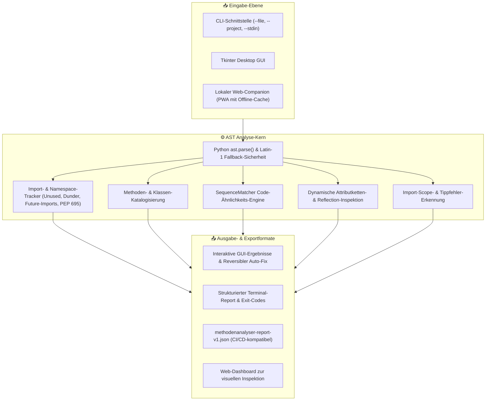
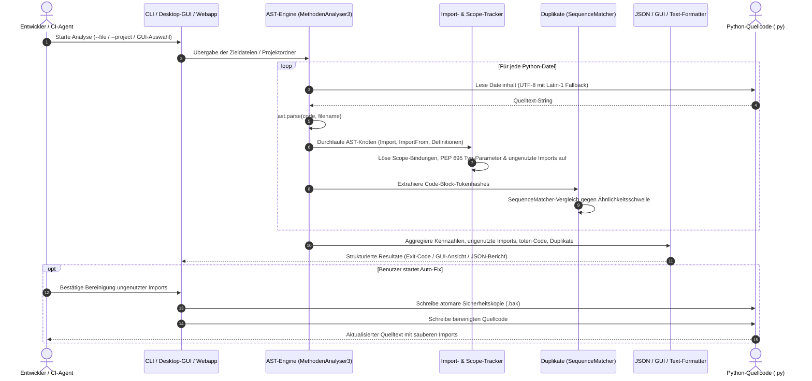

<p align="center">
  
</p>

<p align="center">
  <a href="https://github.com/dev-bricks/MethodenAnalyser/releases/tag/v3.0.1"></a>
  <a href="https://github.com/dev-bricks/MethodenAnalyser/actions/workflows/tests.yml"></a>
  <a href="#entwicklung--tests"></a>
  
  
  
  
  
  <a href="SECURITY.md"></a>
  <a href="https://github.com/astral-sh/ruff"></a>
  <a href="LICENSE"></a>
  <a href="https://github.com/dev-bricks"></a>
  <a href="https://github.com/open-bricks/open-bricks"></a>
  <a href="llms.txt"></a>
</p>

<h1 align="center">MethodenAnalyser</h1>

<h4 align="center">Statischer Python-Code-Analyser mit GUI: findet ungenutzte Imports, tote Definitionen und ähnliche Code-Blöcke mittels AST-Analyse.</h4>

<p align="center">
  <b>Deutsch</b> | <a href="README.md">English</a>
</p>

<p align="center">
  <a href="#features">Funktionen</a> •
  <a href="#vergleich-mit-bestehenden-werkzeugen">Werkzeugvergleich</a> •
  <a href="#architektur--analyse-ablauf">Architektur</a> •
  <a href="#end-to-end-analyse-lebenszyklus">Lebenszyklus</a> •
  <a href="#governance--und-laufzeit-invarianten">Governance-Invarianten</a> •
  <a href="#screenshot">Screenshot</a> •
  <a href="#installation">Installation</a> •
  <a href="#bedienung">Bedienung & Workflows</a> •
  <a href="#lokaler-web-begleiter-nur-lokales-system">Web-Begleiter</a> •
  <a href="#exit-codes">Exit-Codes</a> •
  <a href="#datenschutz--lokale-integrität">Datenschutz</a> •
  <a href="#sicherheitsrichtlinie">Sicherheitsrichtlinie</a> •
  <a href="#ökosystem--partner-werkzeuge">Partner-Ökosystem</a> •
  <a href="#entwicklung--tests">Entwicklung & Tests</a>
</p>

> [!TIP]
> Für LLM-Agenten, automatisierte Tools und RAG-Systeme ist ein kanonischer Index unter [llms.txt](llms.txt) hinterlegt.

---

## Features

| Feature | Beschreibung |
|---------|-------------|
| **AST-Analyse** | Präzise statische Code-Analyse rein über den Python Abstract Syntax Tree (`ast`) |
| **Import-Tracking** | Erkennt aktive, ungenutzte, doppelte, relative und Scope-gebundene Imports inkl. PEP 695 |
| **Methoden-Katalog** | Listet alle Funktionen, Methoden, async-Routinen und Klassen in strukturierter Hierarchie |
| **Duplikat-Erkennung** | Findet ähnliche Code-Blöcke über Pythons `difflib.SequenceMatcher` mit konfigurierbarem Schwellwert |
| **Framework-Erkennung** | Erkennt implizite Nutzung durch Tkinter, PyQt, requests, asyncio, Flask und Standard-Event-Loops |
| **Callback-Erkennung** | Identifiziert Callback-Funktionen und GUI-Befehlsbindungen zuverlässig als aktiv genutzt |
| **Multi-File-Scan** | Analysiert ganze Python-Repositories und Multi-Package-Hierarchien rekursiv |
| **Desktop-GUI** | Klare, barrierefreie Tkinter-Oberfläche mit Echtzeit-Statusleiste, Tooltips und Tastenkürzeln |
| **Reversibler Auto-Fix** | Entfernt ungenutzte Imports nach Bestätigung sicher mit atomaren `.bak`-Backups |
| **Mehrsprachige Oberfläche** | Vollständige Lokalisierung in 6 Sprachen (`de`, `en`, `es`, `zh`, `ja`, `ru`) in GUI, CLI und Web-Begleiter |
| **Keine Abhängigkeiten** | Basiert zu 100 % auf der Python-Standardbibliothek; benötigt keinerlei externe Pakete zur Laufzeit |

---

## Vergleich mit bestehenden Werkzeugen

### Was unterscheidet MethodenAnalyser von pylint, flake8, vulture und radon?

| Feature | MethodenAnalyser | pylint | flake8 | vulture | radon |
|---------|:---:|:---:|:---:|:---:|:---:|
| **Ungenutzte Imports** | **Ja** | Ja | Teilweise | Ja | Nein |
| **Ungenutzte Definitionen** | **Ja** | Teilweise | Nein | Ja | Nein |
| **Code-Ähnlichkeits-Erkennung** | **Ja** | Nein | Nein | Nein | Nein |
| **Framework-Erkennung** | **Ja** | Teilweise | Nein | Nein | Nein |
| **Desktop-GUI** | **Ja** | Nein | Nein | Nein | Nein |
| **Callback-Erkennung** | **Ja** | Nein | Nein | Teilweise | Nein |
| **Keine Installation (Portabel)** | **Ja** | Nein | Nein | Nein | Nein |
| **100% Offline / Zero-Egress** | **Ja** | Ja | Ja | Ja | Ja |

---

## Screenshot


*Die Desktop-Benutzeroberfläche bei der dateibasierten Strukturanalyse mit Kennzahlen.*

---

## Architektur & Analyse-Ablauf



---

## End-to-End Analyse-Lebenszyklus



---

## Governance- und Laufzeit-Invarianten

MethodenAnalyser garantiert 10 verbindliche Architektur-, Laufzeit- und Sicherheitsinvarianten:

| Invariante | Bezeichnung | Spezifikation & Umsetzung |
|---|---|---|
| **INV-LOCAL-01** | 100% Local-First & Zero-Egress | Keinerlei ausgehende Netzwerkaufrufe, Telemetrie, Tracking oder Cloud-Abhängigkeiten. Quellcode und Analysen verlassen den Rechner niemals. |
| **INV-SECURITY-02** | Ausführung mit Benutzerrechten | Läuft ausnahmslos im unprivilegierten Benutzerkontext (`RunAsInvoker`). Benötigt und fordert niemals Administrator- oder Root-Rechte an. |
| **INV-AST-03** | Inerte statische AST-Analyse | Analysiert Quelltexte rein über Pythons eingebautes `ast.parse()`. Zieldateien oder Modulnamen werden niemals dynamisch importiert oder ausgeführt. |
| **INV-ENCODING-04** | Verlustfreie Multi-Encoding-Resilienz | Liest Dateien standardmäßig als UTF-8 mit automatischem Latin-1 Fallback. Verändert niemals Original-Encodings oder deutsche Umlaute. |
| **INV-ISOLATION-05** | Loopback Web-Begleiter-Isolation | Der lokale Hilfsserver bindet sich standardmäßig ausschließlich an `127.0.0.1`. Der LAN-Modus `--host 0.0.0.0` erfordert explizite Aktivierung. |
| **INV-TRAVERSAL-06** | Pfad-Traversal- & ZIP-Sicherheit | Der Web-Begleiter blockiert Directory-Traversal (`..`), begrenzt Dateizahlen und unkomprimierte Byte-Mengen zur Abwehr von ZIP-Bomben. |
| **INV-AUTOFIX-07** | Reversibler Auto-Fix mit Backup | Auto-Fix erfordert zwingend eine explizite Bestätigung und legt vor jeder Änderung eine atomare `.bak`-Sicherheitskopie an. |
| **INV-PLATFORM-08** | Plattformübergreifende Parität | Vollständige Standardbibliothek-Kompatibilität, verifiziert auf Windows Server 2025, Ubuntu Linux und macOS 26. |
| **INV-SYNC-09** | Cloud-Sync- & Lock-Resilienz | Beachtet Dateisperren (`LOCK.*`) im Fail-Closed-Verfahren und ignoriert Cloud-Sync-Konfliktdateien (`*-conflict-*`). |
| **INV-SLA-10** | 48h Sicherheits-SLA & 5-Tage-Triage | Verbindliches Sicherheitsversprechen: Eingangsbestätigung binnen 48 Stunden, Triage und Behebungsplan binnen 5 Werktagen. |

---

## Installation

Keine externen Laufzeit-Abhängigkeiten. Nur Python 3.10+ wird benötigt.

```bash
git clone https://github.com/dev-bricks/MethodenAnalyser.git
cd MethodenAnalyser
python MethodenAnalyser3.py
```

Unter Windows kann das Tool auch direkt per Doppelklick auf `START.bat` gestartet werden.

Die Laufzeit nutzt ausschließlich die Python-Standardbibliothek. Für Tests und EXE-Builds installieren
Sie die abgegrenzte Entwickler-Toolchain aus [requirements-dev.txt](requirements-dev.txt);
die Befehle und Build-Grenzen sind in [BUILD.md](BUILD.md) dokumentiert.

---

## Bedienung

### 1. Einzelne Datei über die GUI analysieren
1. Tool starten: `python MethodenAnalyser3.py` oder Doppelklick auf `START.bat`.
2. Auf **Datei analysieren** klicken und eine `.py`-Datei auswählen.
3. Die Befunde im Ausgabebereich einsehen.

### 2. Ganzes Projekt über die GUI analysieren
1. Auf **Projekt analysieren** klicken und einen Ordner auswählen.
2. Das Tool durchsucht alle `.py`-Dateien innerhalb des Ordners rekursiv.
3. Ein zusammenfassender Projektbericht wird erstellt und dargestellt.

### 3. CLI-Modus für Automatisierung & CI/CD
MethodenAnalyser kann vollständig ohne grafische Oberfläche in Terminal- und CI-Pipelines genutzt werden:

```bash
# Einzelne Datei analysieren
python MethodenAnalyser3.py --file pfad/zur/datei.py

# Ganzes Projekt analysieren
python MethodenAnalyser3.py --project pfad/zum/projekt

# Datei analysieren und JSON-Bericht exportieren
python MethodenAnalyser3.py --file pfad/zur/datei.py --json-output

# Per stdin analysieren und JSON ausgeben
type pfad\zur\datei.py | python MethodenAnalyser3.py --stdin --json-output snippet.json

# CLI-Hilfe und Berichte in gewünschter Sprache (de, en, es, zh, ja, ru)
python MethodenAnalyser3.py --lang de --file pfad/zur/datei.py
```

Das Flag `--json-output` exportiert einen maschinenlesbaren Bericht namens `methodenanalyser-report-v1.json` (oder unter dem übergebenen Dateinamen). Das Schema ist in [EXPORTFORMAT.md](EXPORTFORMAT.md) beschrieben.

Der lokale `POST /api/analyze`-Endpunkt akzeptiert `source_kind` `snippet`, `file`
und `zip`. Ein `project`-POST wird bewusst abgewiesen; Projektberichte entstehen
über den Desktop-/CLI-Pfad und können separat in die Web-Oberfläche importiert werden.

### 4. Lokaler Web-Begleiter (nur lokales System)
Für Browser-basierte Code-Snippets, Datei-Uploads oder kleine ZIP-Archive kann der
optionale lokale Hilfsserver gestartet werden. Es handelt sich um keinen Cloud-Dienst:

```bash
python webapp/server.py
```

Oder per Doppelklick auf `START_WEBAPP.bat`. Der Server läuft standardmäßig auf `http://127.0.0.1:8765/` und greift auf denselben AST-Analysekern zurück. Die sichtbaren Bedienelemente nutzen den gemeinsamen Sechs-Sprachen-Katalog; die Sprachwahl bleibt im lokalen Browserprofil gespeichert.
*   **PWA-Unterstützung:** Funktioniert als Progressive Web App mit Offline-Caching (Service Worker) und lokalem Entwurfsspeicher.
*   **Berichts-Import:** Bestehende `methodenanalyser-report-v1.json`-Dateien können zur visuellen Begutachtung direkt importiert werden.
*   **LAN-Zugriff:** Für geräteübergreifende Tests (z. B. Voransicht auf Mobilgeräten) kann der Server im lokalen Netzwerk freigegeben werden:
    ```bash
    python webapp/server.py --host 0.0.0.0 --port 8765
    ```
    Dieser bewusste LAN-Testmodus verwendet lokales HTTP ohne Authentifizierung oder TLS. Nutzen Sie ihn ausschließlich in vertrauenswürdigen Heim- oder Firmennetzwerken. Details siehe [WEBAPP.md](WEBAPP.md).

### 5. macOS- und Linux-Quelltext-Verifikation
Obwohl die GUI auf Tkinter für Windows optimiert ist, läuft die Codebasis nachweislich vollständig auf macOS und Linux aus dem Quelltext:

```bash
python -m py_compile MethodenAnalyser3.py manage_translations.py translator.py webapp/server.py
python -m unittest discover -s tests -v
```

Ein GitHub Actions Workflow führt diese Testsuite auf Windows Server 2025 mit Visual Studio 2026 (Python 3.10-3.13), Ubuntu (Python 3.11, 3.13) und macOS 26 (Python 3.11, 3.13) automatisiert aus.

---

## Exit-Codes

Für Skripte und CI/CD gibt MethodenAnalyser folgende Exit-Codes zurück:
- `0` = Analyse erfolgreich, keine Probleme oder Auffälligkeiten gefunden.
- `1` = Syntax-, Argument- oder Analysefehler.
- `2` = Analyse erfolgreich, aber Befunde (ungenutzter Code, Duplikate) ermittelt.
- `3` = Projektanalyse abgeschlossen, aber einzelne Dateien konnten nicht geparst werden.

---

## Beispiel-Ausgabe

```text
=== ANALYSE: mein_skript.py ===

IMPORTS (3 gesamt):
  os        - aktiv
  json      - aktiv
  pathlib   - potenziell ungenutzt

DEFINITIONEN (5 gesamt):
  main()
  load_config()
  alter_helfer() - keine Referenzen gefunden

ÄHNLICHE CODE-BLÖCKE (Schwelle: 80%):
  Zeilen 42-55 <-> Zeilen 88-101 (Ähnlichkeit: 91%)
```

---

## Konfiguration

Erkennungsparameter können direkt im Quellcode angepasst werden:

```python
SIMILARITY_THRESHOLD = 0.8    # Ähnlichkeitsschwelle (0.0 bis 1.0) für Duplikaterkennung
WINDOW_GEOMETRY = "1200x700"  # Desktop-Fenstermaße
```

---

## Datenschutz & Lokale Integrität

MethodenAnalyser arbeitet zu 100 % lokal. Weder Quelltexte noch Pfade oder Analyseergebnisse werden über das Internet übertragen. Die Software enthält keine Telemetrie, Analysedienste, Cloud-Schnittstellen oder Drittanbieter-Tracker. Der Web-Begleiter bindet standardmäßig an `127.0.0.1`.

Build- und Paketierungsdateien sind in `.gitignore` so hinterlegt, dass sie nicht versioniert werden.

---

## Sicherheitsrichtlinie

Sicherheit und Datensouveränität stehen an oberster Stelle.
- **Local-First-Garantie**: 100 % Offline-Analyse ohne Telemetrie.
- **Inerte Analyse**: Quelltexte werden weder ausgeführt noch dynamisch geladen.
- **SLA-Versprechen**: Eingangsbestätigung binnen **48 Stunden**; Triage binnen **5 Werktagen**.
- **Meldewege**:
  - GitHub Advisory: [Sicherheitsbericht einreichen](https://github.com/dev-bricks/MethodenAnalyser/security/advisories/new)
  - Sicherheits-E-Mail: [security@open-bricks.org](mailto:security@open-bricks.org)
  - Ökosystem-Sicherheit: [security@ellmos.ai](mailto:security@ellmos.ai)
  - Maintainer: [support@lukasgeiger.com](mailto:support@lukasgeiger.com)

Vollständige Richtlinie siehe [SECURITY.md](SECURITY.md).

---

## Repository-Hygiene

- GitHub Remote: `dev-bricks/MethodenAnalyser`
- Vor jedem Commit oder Release ausführen:
  `git branch --show-current`,
  `git rev-list --left-right --count master...origin/master` und
  `git status --short --ignored`.
- Erwartetes Gate: Branch `master`, `0 0` Ahead/Behind und sauberer Arbeitsbaum.
- Vor dem Commit: `git status --short`, Secret-Scan und Bytecode-Prüfung via `python -m py_compile MethodenAnalyser3.py manage_translations.py translator.py`.

---

## Entwicklung & Tests

```bash
# Syntax- und Bytecode-Prüfung
python -m py_compile MethodenAnalyser3.py manage_translations.py translator.py webapp/server.py
python -m compileall -q .

# Testsuite ausführen
pytest -v
```

Für den reproduzierbaren pytest/PyInstaller-Bereich und den `build_exe.bat`-Fallback siehe [BUILD.md](BUILD.md) und [_sources/CROSSCHECK.md](_sources/CROSSCHECK.md).

GitHub Actions führt diese Smoke-Tests bei jedem Push aus. Für LLM-Agenten und Indexer ist eine schlanke Kontextdatei unter [llms.txt](llms.txt) hinterlegt.

---

## Ökosystem & Partner-Werkzeuge

`MethodenAnalyser` ist Teil der Entwicklersuite [`dev-bricks`](https://github.com/dev-bricks) und der Dachorganisation [`open-bricks`](https://github.com/open-bricks):

| Werkzeug | Organisation | Beschreibung |
|---|---|---|
| **[DevCenter](https://github.com/dev-bricks/DevCenter)** | `dev-bricks` | Zentrales Entwickler-Cockpit und Workflow-Koordinator |
| **[CodeBox](https://github.com/dev-bricks/CodeBox)** | `dev-bricks` | Lokale, erweiterbare IDE mit deklarativer Plugin-Architektur |
| **[MethodenAnalyser](https://github.com/dev-bricks/MethodenAnalyser)** | `dev-bricks` | Statischer Python-Code- & Methoden-Analyser mit lokaler GUI & CLI |
| **[CareCenter-for-Codex](https://github.com/dev-bricks/CareCenter-for-Codex)** | `dev-bricks` | Systemhygiene- & Pflegecenter für AI-Agenten-Setups |
| **[app-rotator](https://github.com/dev-bricks/app-rotator)** | `dev-bricks` | Desktop-Fokus- und Anwendungs-Rotationsmanager |
| **[lock-master](https://github.com/ellmos-ai/lock-master)** | `ellmos-ai` | Prozessübergreifendes Sperr- und Concurrency-Sicherheitssystem |
| **[clutch](https://github.com/ellmos-ai/clutch)** | `ellmos-ai` | Lokale LLM-Orchestrierung, Modell-Routing und Prompt-Ausführung |
| **[assistant-core](https://github.com/ellmos-ai/assistant-core)** | `ellmos-ai` | Threadsichere Persistenz- und Nachrichtenspeicher-Basis |
| **[decision-clicker](https://github.com/ellmos-ai/decision-clicker)** | `ellmos-ai` | Lokales Governance- und Entscheidungs-Ledger |
| **[policy-registry](https://github.com/ellmos-ai/policy-registry)** | `ellmos-ai` | Deklaratives Regelprüf- und Verifikations-Framework |
| **[ellmos-codecommander-mcp](https://github.com/ellmos-ai/ellmos-codecommander-mcp)** | `ellmos-ai` | MCP-Server für AST-Refactoring und Code-Intelligenz |
| **[ellmos-filecommander-mcp](https://github.com/ellmos-ai/ellmos-filecommander-mcp)** | `ellmos-ai` | MCP-Server für sichere lokale Dateisystem-Operationen |
| **[ExplorerPro](https://github.com/file-bricks/ExplorerPro)** | `file-bricks` | Moderner Dateimanager mit Tabs und Duplikat-Erkennung |
| **[ProFiler](https://github.com/file-bricks/ProFiler)** | `file-bricks` | Leistungsstarke Dokumenten-Kategorisierung mit Schwärzung |
| **[FormularErstellen](https://github.com/doc-bricks/FormularErstellen)** | `doc-bricks` | Deterministischer formular- und Umfrage-Generator |
| **[open-bricks](https://github.com/open-bricks/open-bricks)** | `open-bricks` | Dachorganisation modularer, offline-fähiger Entwickler-Werkzeuge |

---

## Lizenz

Dieses Projekt ist unter der [MIT-Lizenz](LICENSE) lizenziert.

---

## Haftungsausschluss

Dieses Projekt ist eine unentgeltliche Open-Source-Schenkung gemäß §§ 516 ff. BGB. Gemäß **§ 521 BGB** ist die Haftung auf Vorsatz und grobe Fahrlässigkeit beschränkt. Weltweit gilt der Haftungsausschluss der Standard-MIT-Lizenz.

Nutzung auf eigene Verantwortung. Keine Supportgarantie oder Gewährleistung für Fehlerfreiheit.
