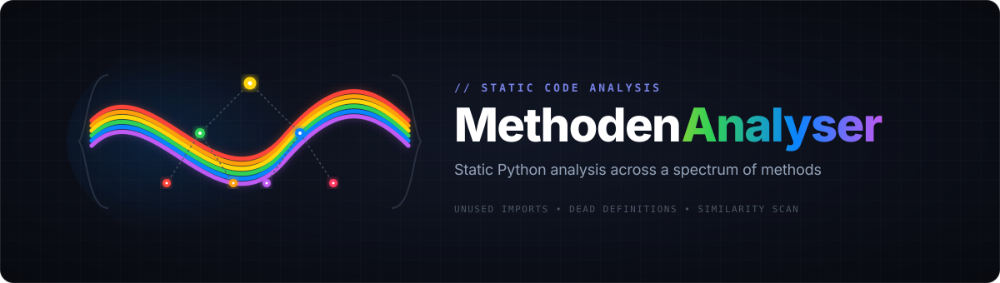
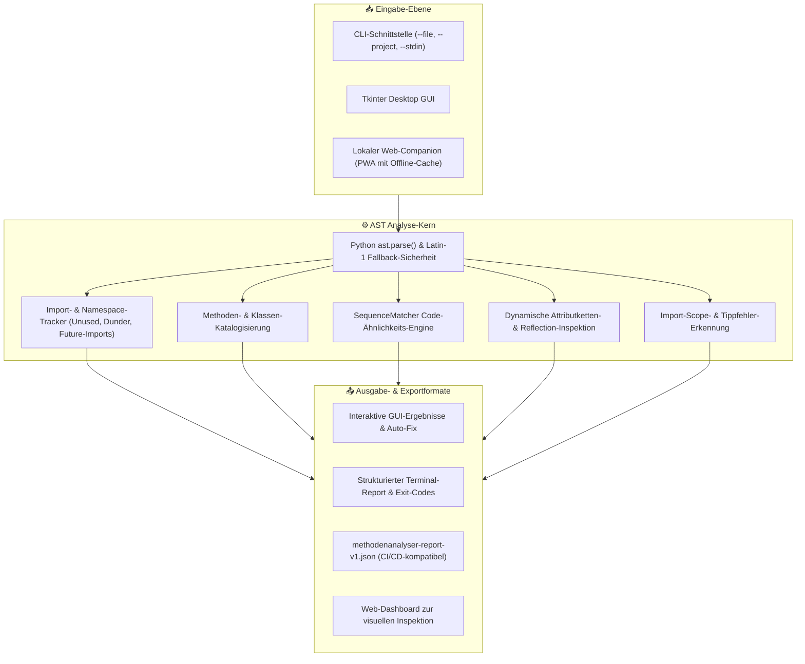

<p align="center">
  
</p>

<p align="center">
  
  
  
  
  
  
  
  
  
</p>

<h1 align="center">MethodenAnalyser</h1>

<h4 align="center">Statischer Python-Code-Analyser mit GUI: findet ungenutzte Imports, tote Definitionen und ähnliche Code-Blöcke.</h4>

<p align="center">
  <b>Deutsch</b> | <a href="README.md">English</a>
</p>

> [!TIP]
> Für LLM-Agenten, automatisierte Tools und RAG-Systeme ist ein kanonischer Index unter [llms.txt](llms.txt) hinterlegt.

---

## Features

| Feature | Beschreibung |
|---------|-------------|
| **AST-Analyse** | Präzise Analyse über den Python Abstract Syntax Tree |
| **Import-Tracking** | Erkennt genutzte und ungenutzte Imports |
| **Methoden-Katalog** | Listet alle Funktionen, Methoden und Klassen |
| **Duplikat-Erkennung** | Findet ähnliche Code-Blöcke mit konfigurierbarem Schwellwert |
| **Framework-Erkennung** | Erkennt implizite Nutzung durch Tkinter, requests, asyncio und weitere Frameworks |
| **Callback-Erkennung** | Identifiziert Callback-Funktionen korrekt als genutzt |
| **Multi-File** | Analysiert ganze Python-Projekte rekursiv |
| **GUI** | Einfache Tkinter-Oberfläche, kein Terminal nötig |

### Was unterscheidet MethodenAnalyser von pylint / flake8 / vulture?

| Feature | MethodenAnalyser | pylint | flake8 | vulture | radon |
|---------|:---:|:---:|:---:|:---:|:---:|
| Ungenutzte Imports | ja | ja | teilweise | ja | nein |
| Ungenutzte Definitionen | ja | teilweise | nein | ja | nein |
| **Code-Ähnlichkeit** | ja | nein | nein | nein | nein |
| **Framework-Erkennung** | ja | teilweise | nein | nein | nein |
| **GUI** | ja | nein | nein | nein | nein |
| **Callback-Erkennung** | ja | nein | nein | teilweise | nein |
| Keine Installation | ja | nein | nein | nein | nein |

---

## Screenshot


Die aktuelle Ansicht zeigt die dateibasierte Analyse mit GUI-Workflow statt reiner CLI-Ausgabe.

---

## Architektur & Analyse-Ablauf



---

## Installation

Keine externen Laufzeit-Abhängigkeiten. Nur Python 3.10+ wird benötigt.

```bash
git clone https://github.com/dev-bricks/MethodenAnalyser.git
cd MethodenAnalyser
python MethodenAnalyser3.py
```

Unter Windows kann das Tool auch per Doppelklick auf `START.bat` gestartet werden.

Die Laufzeit benötigt nur die Python-Standardbibliothek. Für Tests und EXE-
Builds die begrenzte Toolchain aus [requirements-dev.txt](requirements-dev.txt)
installieren; Befehle und Build-Grenzen stehen in [BUILD.md](BUILD.md).

---

## Verwendung

### Einzelne Datei analysieren

1. Tool starten: `python MethodenAnalyser3.py` oder `START.bat`.
2. **Datei analysieren** klicken und eine `.py`-Datei auswählen.
3. Ergebnisse im Ausgabefenster prüfen.

### Ganzes Projekt analysieren

1. **Projekt analysieren** klicken und einen Projektordner auswählen.
2. Alle `.py`-Dateien werden rekursiv durchsucht.
3. Der aggregierte Projekt-Report wird im Ausgabefenster angezeigt.

### CLI-Modus für Automationen

Die GUI bleibt Standard, zusätzlich kann MethodenAnalyser jetzt headless laufen:

```bash
python MethodenAnalyser3.py --file pfad/zur/datei.py
python MethodenAnalyser3.py --project pfad/zum/projekt
python MethodenAnalyser3.py --file pfad/zur/datei.py --json-output
type pfad\zur\datei.py | python MethodenAnalyser3.py --stdin --json-output snippet.json
```

`--json-output` schreibt zusätzlich den maschinenlesbaren Report `methodenanalyser-report-v1.json`. Mit eigenem Dateinamen kann der Report gezielt abgelegt werden; das Format ist in [EXPORTFORMAT.md](EXPORTFORMAT.md) dokumentiert.

### Lokaler Web-Hilfsmodus (nur derselbe Rechner)

Für Snippets, einzelne Python-Dateien und kleine ZIP-Archive gibt es zusätzlich eine optionale lokale Weboberfläche:

Für `POST /api/analyze` sind `source_kind` `snippet`, `file` und `zip`
zulässig; ein `project`-POST wird bewusst abgelehnt. Ein `project`-Report darf
separat als `methodenanalyser-report-v1.json` importiert werden. Die Quellen-
matrix steht in [EXPORTFORMAT.md](EXPORTFORMAT.md) und [WEBAPP.md](WEBAPP.md).

```bash
python webapp/server.py
```

Unter Windows startet `START_WEBAPP.bat` denselben lokalen Server. Die Oberfläche läuft standardmäßig unter `http://127.0.0.1:8765/`, nutzt den bestehenden Analysekern und zeigt Text- sowie JSON-Reports an. ZIP-Uploads werden lokal an den Python-Prozess geschickt, dort temporär entpackt und als kleines Projekt analysiert. Zusätzlich kann die lokale Weboberfläche bestehende `methodenanalyser-report-v1.json`-Dateien importieren. Sie ist ein Hilfs-/Demo-Modus für denselben Rechner, keine Companion-App und keine eigene Mobile-Produktlinie. Details stehen in [WEBAPP.md](WEBAPP.md).

Die PWA speichert den aktuellen Entwurf und den letzten JSON-Report lokal im Browser, bietet einen Install-Flow für Chromium-basierte Browser und hält die bereits geladene Oberfläche per Service Worker offline verfügbar. Für neue Analysen muss der lokale Python-Server trotzdem laufen.

Für Android-/iOS-Tests im selben WLAN kann derselbe lokale Dienst gezielt auf dem Netzwerk lauschen:

```bash
python webapp/server.py --host 0.0.0.0 --port 8765
```

Die lokale Weboberfläche kann LAN-URLs anzeigen, falls der Server bewusst im Netzwerk freigegeben wird. Das bleibt ein technischer Testpfad, kein geplantes Android-/iOS-Produkt.
Dieser bewusste LAN-Testmodus nutzt lokales HTTP ohne Authentifizierung oder TLS und gehört ausschließlich in ein vertrauenswürdiges privates Netz. Er ist weder ein Cloud-Dienst noch eine Mobile-Produktlinie. Details stehen in [WEBAPP.md](WEBAPP.md).
Zusätzlich bündelt die **PWA-Testkarte** Install-Status, Service-Worker-, Speicher- und Viewport-Diagnostik in einer kopierbaren Kurzfassung für lokale Browser-Smokes.

### macOS- und Linux-Smoke

Die Desktop-Version bleibt Windows-first, aber der Quellstand wird jetzt gezielt auch als Source-Smoke für macOS und Linux abgesichert. Lokal reicht dafür dieselbe Basis:

```bash
python -m py_compile MethodenAnalyser3.py manage_translations.py translator.py webapp/server.py
python -m unittest discover -s tests -v
```

Zusätzlich prüft die GitHub-Action denselben Stand automatisch auf Windows Server 2025 mit Visual Studio 2026 (Python 3.10 bis 3.12) sowie auf Ubuntu (Python 3.11) und macOS 26 (Python 3.11). Damit bleiben Tkinter-Import, CLI und Web-Companion auch außerhalb von Windows im Blick, ohne bereits eine eigene Mac- oder Linux-Paketlinie zu versprechen.

Exit-Codes:

- `0` = Analyse erfolgreich und keine Findings im Report
- `1` = Aufruf- oder Analysefehler
- `2` = Analyse erfolgreich, aber Findings vorhanden
- `3` = Projektanalyse mit Teilfehlern in einzelnen Dateien

---

## Beispiel-Output

```text
=== ANALYSE: my_script.py ===

IMPORTS (3 gesamt):
  os        - genutzt
  json      - genutzt
  pathlib   - möglicherweise ungenutzt

DEFINITIONEN (5 gesamt):
  main()
  load_config()
  old_helper() - nicht referenziert

ÄHNLICHE CODE-BLÖCKE (Schwellwert: 80%):
  Zeilen 42-55 <-> Zeilen 88-101 (Ähnlichkeit: 91%)
```

---

## Konfiguration

Im Quellcode anpassbar:

```python
SIMILARITY_THRESHOLD = 0.8    # Schwellwert für Duplikat-Erkennung
WINDOW_GEOMETRY = "1200x700"  # Fenstergröße
```

---

## Datenschutz / Privacy

MethodenAnalyser arbeitet vollständig lokal. Der ausgewählte Python-Code, Dateipfade und Analyseergebnisse werden nicht an den Entwickler oder externe Dienste übertragen. Der optionale Web-Hilfsmodus bindet standardmäßig an `127.0.0.1`; sein expliziter LAN-Testmodus `--host 0.0.0.0` hat keine Authentifizierung und kein TLS und darf nur in einem vertrauenswürdigen privaten Netz verwendet werden.

Release-Artefakte wie EXE-Dateien, lokale Builds und Store-Pakete bleiben außerhalb des Git-Repositorys und gehören in lokale `releases/`-Ordner oder GitHub Releases.

## Repository-Hygiene

- GitHub-Remote: `dev-bricks/MethodenAnalyser`
- Die öffentliche Hygiene-Baseline ist ein benannter Commit oder Tag; diese
  README behauptet keine dauerhaft gültige Ahead/Behind-Zahl. Vor Release oder
  Übergabe ausführen: `git branch --show-current`,
  `git rev-list --left-right --count master...origin/master` und
  `git status --short --ignored`.
- Erwartetes Gate: Branch `master`, für die benannte Baseline `0 0` Ahead/Behind
  und ein sauberer Arbeitsbaum. Uncommittete Icon-/Asset-Änderungen bleiben
  außerhalb dieses Dokumentations-Slices und werden weder übernommen noch
  verworfen.
- Secret-/Privacy-Scan und Kompilationsprüfung sind für dieselbe benannte
  Baseline zu wiederholen; ein zeitabhängiges Scan-Ergebnis wird hier nicht
  behauptet.
- Keine Telemetrie, keine Netzwerkverbindungen und keine Cloud-Synchronisierung aus der Anwendung heraus.
- Lokale Build-, Release-, Coverage-, Cache- und Signierartefakte sind über `.gitignore` ausgeschlossen.
- Interne Wartungsnotizen wie `AUFGABEN.txt` bleiben lokal und werden nicht im Git-Quellbaum veröffentlicht.
- Vor Veröffentlichungen: `git status --short`, Secret-Scan und `python -m py_compile MethodenAnalyser3.py manage_translations.py translator.py` ausführen.

---

## Entwicklung / Verification

```bash
python -m py_compile MethodenAnalyser3.py manage_translations.py translator.py webapp/server.py
python -m unittest discover -s tests -v
```

Der reproduzierbare pytest-/PyInstaller-Bereich und der Fallback von
`build_exe.bat` sind in [BUILD.md](BUILD.md) und
[_sources/CROSSCHECK.md](_sources/CROSSCHECK.md) festgelegt.

GitHub Actions führt denselben Smoke-Test auf explizit gepinnten 2026-Migrations-Images aus: `windows-2025-vs2026` für Windows und `macos-26` für macOS. Damit hängt der Smoke-Test nicht mehr von der schrittweisen Umstellung der Labels `windows-latest` und `macos-latest` ab.

Für Crawler, LLMs und Verzeichnisdienste liegt ein knapper maschinenlesbarer Projektkontext in [llms.txt](llms.txt). Die Community-Workflows verwenden aktuelle `actions/stale`- und `actions/first-interaction`-Versionen.

---

## Ökosystem & Verwandte Werkzeuge

`MethodenAnalyser` ist Teil der [`dev-bricks`](https://github.com/dev-bricks)-Suite und des modularen [`open-bricks`](https://github.com/open-bricks)-Entwicklerökosystems:

| Werkzeug | Beschreibung |
|---|---|
| **[DevCenter](https://github.com/dev-bricks/DevCenter)** | Zentrale Entwickler-Zentrale und automatisierter Workflow-Koordinator |
| **[CodeBox](https://github.com/dev-bricks/CodeBox)** | Lokale, erweiterbare IDE mit deklarativer Plugin-Architektur |
| **[MethodenAnalyser](https://github.com/dev-bricks/MethodenAnalyser)** | Statischer Python Code- und Methoden-Analyser mit lokaler GUI |
| **[CareCenter-for-Codex](https://github.com/dev-bricks/CareCenter-for-Codex)** | Systemhygiene- und Gesundheitszentrum für KI-Agenten-Setups |
| **[lock-master](https://github.com/ellmos-ai/lock-master)** | Prozessübergreifendes Lock- und Nebenläufigkeits-Sicherheitssystem |

---

## Lizenz

Dieses Projekt steht unter der [MIT License](LICENSE).

---

## Haftung / Liability

Dieses Projekt ist eine **unentgeltliche Open-Source-Schenkung** im Sinne der §§ 516 ff. BGB. Die Haftung des Urhebers ist gemäß **§ 521 BGB** auf **Vorsatz und grobe Fahrlässigkeit** beschränkt. Ergänzend gilt der Haftungsausschluss der MIT License.

Nutzung auf eigenes Risiko. Keine Wartungszusage, keine Verfügbarkeitsgarantie, keine Gewähr für Fehlerfreiheit oder Eignung für einen bestimmten Zweck.

This project is an unpaid open-source donation. Liability is limited to intent and gross negligence (§ 521 German Civil Code). Use at your own risk. No warranty, no maintenance guarantee, no fitness-for-purpose assumed.
