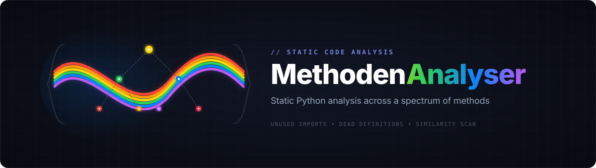
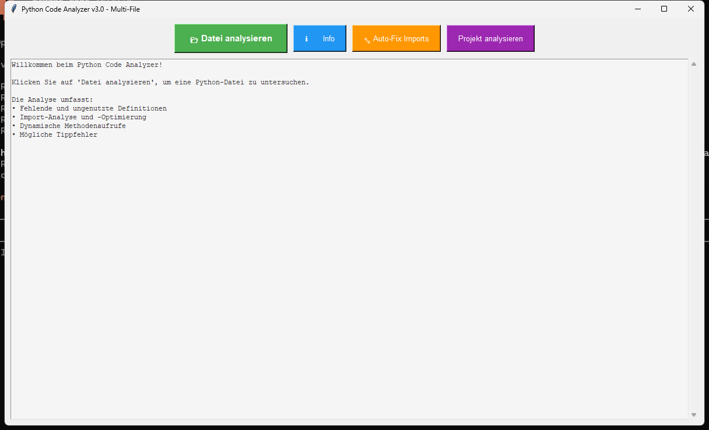
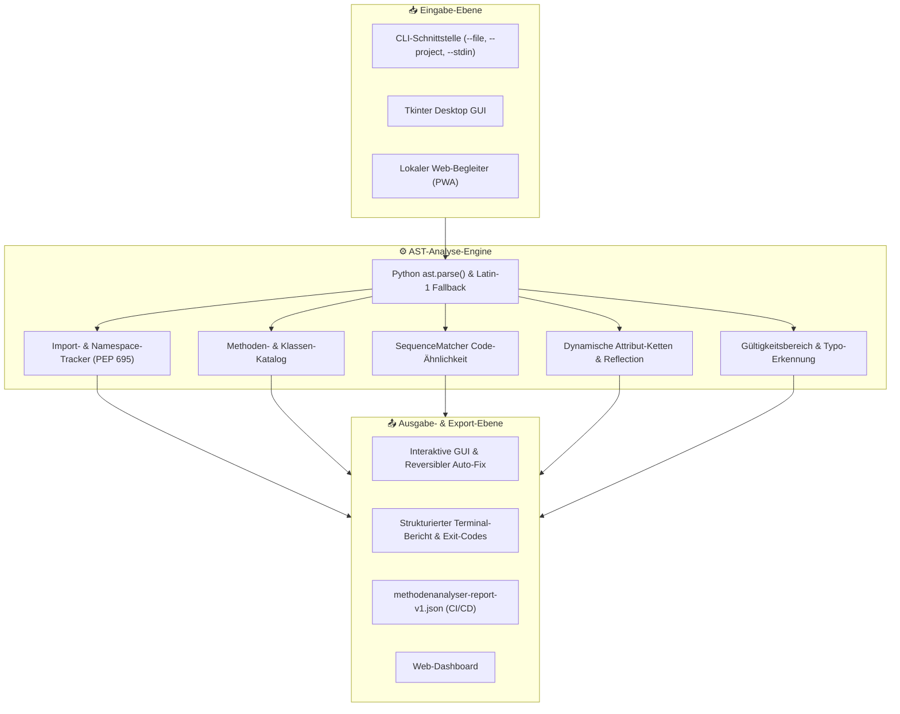
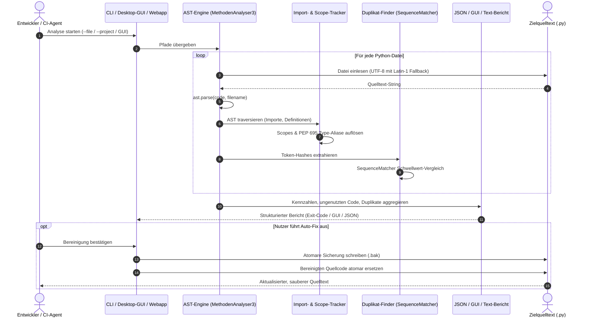

<p align="center">
  
</p>

<p align="center">
  <a href="https://github.com/dev-bricks/MethodenAnalyser/releases/tag/v3.0.2"></a>
  <a href="https://github.com/dev-bricks/MethodenAnalyser/actions/workflows/tests.yml"></a>
  <a href="#sec-13"></a>
  <a href="MARKETING-LOG.txt"></a>
  <a href="THIRD_PARTY_LICENSES.txt"></a>
  
  
  
  
  
  <a href="SECURITY.md"></a>
  <a href="#sec-17"></a>
  <a href="https://github.com/astral-sh/ruff"></a>
  <a href="LICENSE"></a>
  <a href="https://github.com/dev-bricks"></a>
  <a href="https://github.com/open-bricks/open-bricks"></a>
  <a href="llms.txt"></a>
</p>

<h1 align="center">MethodenAnalyser</h1>

<h4 align="center">Statischer Python-Code-Analyser mit GUI: findet ungenutzte Imports, tote Definitionen und ähnliche Code-Blöcke mittels AST-Analyse.</h4>

<p align="center">
  <b>Deutsch</b> | <a href="README.md">English</a>
</p>

---

<p align="center">
  <a href="#features">1. Funktionen</a> •
  <a href="#architektur">2. Vier-Sichten-Architektur</a> •
  <a href="#zielgruppen">3. Zielgruppen</a> •
  <a href="#installation">4. Installation</a> •
  <a href="#screenshot">5. GUI-Arbeitsabläufe</a> •
  <a href="#bedienung">6. Headless-CLI</a> •
  <a href="#auto-fix">7. Reversibler Auto-Fix</a> •
  <a href="#web-begleiter">8. Web-Begleiter</a> •
  <a href="#vergleich-mit-bestehenden-werkzeugen">9. Werkzeugvergleich</a> •
  <a href="#architektur--analyse-ablauf">10. Duale Mermaid-Diagramme</a> •
  <a href="#governance">11. Governance-Invarianten</a> •
  <a href="#exit-codes">12. Exit-Codes</a> •
  <a href="#entwicklung--tests">13. Entwicklung & Tests</a> •
  <a href="#drittanbieter-lizenzen">14. Level 1 SBOM</a> •
  <a href="#ökosystem--partner-werkzeuge">15. Partner-Ökosystem</a> •
  <a href="#sicherheitsrichtlinie">16. Sicherheit & Datenschutz</a> •
  <a href="#haftung">17. Gesetzlicher Hinweis</a> •
  <a href="#lizenz">18. Lizenz & Dach</a>
</p>

> [!TIP]
> Für LLM-Agenten, automatisierte Tools und RAG-Systeme ist ein kanonischer Index unter [llms.txt](llms.txt) hinterlegt.

---

### Schnellnavigation

1. [Kernnutzen & Funktionen](#sec-01) · 2. [Vier-Sichten-Architektur](#sec-02) · 3. [Zielgruppen & Auffindbarkeit](#sec-03) · 4. [Installation & Schnellstart](#sec-04) · 5. [Desktop-GUI & Arbeitsabläufe](#sec-05) · 6. [Headless-CLI & Automatisierung](#sec-06) · 7. [Reversibler Auto-Fix & Backup-Lebenszyklus](#sec-07) · 8. [Lokaler Web-Begleiter & PWA](#sec-08) · 9. [10-Dimensionen-Vergleichsmatrix](#sec-09) · 10. [Duale Mermaid-Diagramme](#sec-10) · 11. [Governance & 10 Laufzeit-Invarianten](#sec-11) · 12. [Exit-Codes & JSON-Schemaspezifikation](#sec-12) · 13. [Tests, Verifikation & CI-Härtung](#sec-13) · 14. [Level 1 SBOM & Drittanbieter-Lizenzen](#sec-14) · 15. [Geschwister-Ökosystem & Partner-Matrix](#sec-15) · 16. [Sicherheitsrichtlinie & Zero-Egress](#sec-16) · 17. [Gesetzlicher Hinweis (§ 521 BGB)](#sec-17) · 18. [Lizenz & Open-Source-Dach](#sec-18)

---

<a id="sec-01"></a>
<a id="1-kernnutzen--funktionen"></a>
<a id="1-kernnutzen"></a>
<a id="kernnutzen"></a>
<a id="1-funktionen"></a>
<a id="funktionen"></a>
<a id="features"></a>
<a id="1-features"></a>
<a id="1-value-proposition--features"></a>
<a id="1-value-proposition"></a>
<a id="value-proposition"></a>
## 1. Kernnutzen & Funktionen

MethodenAnalyser liefert sofortige, installationsfreie statische Code-Analyse für Python. Vollständig auf dem Abstract Syntax Tree (`ast`) von Python basierend, prüft das Werkzeug Einzeldateien und ganze Repositories auf ungenutzte Importe, verwaiste Funktionsdefinitionen, Code-Duplikate und strukturelle Kennzahlen – vollständig offline und ohne externe Laufzeit-Abhängigkeiten.

| Feature | Beschreibung |
|---------|-------------|
| **AST-Analyse** | Präzise statische Code-Analyse rein über den Python Abstract Syntax Tree (`ast.parse`) |
| **Import-Tracking** | Erkennt aktive, ungenutzte, doppelte, relative und Scope-gebundene Imports inkl. PEP 695 Type-Aliasen |
| **Methoden-Katalog** | Listet alle Funktionen, Methoden, async-Routinen und Klassen in strukturierter Hierarchie |
| **Duplikat-Erkennung** | Findet ähnliche Code-Blöcke über Pythons `difflib.SequenceMatcher` mit konfigurierbarem Schwellwert |
| **Framework-Erkennung** | Erkennt implizite Nutzung durch Tkinter, PyQt, requests, asyncio, Flask und Standard-Event-Loops |
| **Callback-Erkennung** | Identifiziert Callback-Funktionen und GUI-Befehlsbindungen zuverlässig als aktiv genutzt |
| **Multi-File-Scan** | Analysiert ganze Python-Repositories und Multi-Package-Hierarchien rekursiv |
| **Desktop-GUI** | Klare, barrierefreie Tkinter-Oberfläche mit Echtzeit-Statusleiste, Tooltips und WCAG 2.1 AA Tastaturkürzeln |
| **Reversibler Auto-Fix** | Prüft den aktuellen Quelltext nach Bestätigung erneut und entfernt nur bestätigte, weiterhin ungenutzte Imports; erstellt `.bak`-Backups, erhält benachbarte Anweisungen und prüft die Ausgabesyntax |
| **Mehrsprachige Oberfläche** | Vollständige Lokalisierung in 6 Sprachen (`de`, `en`, `es`, `zh`, `ja`, `ru`) in GUI, CLI und Web-Begleiter |
| **Keine Abhängigkeiten** | Basiert zu 100 % auf der Python-Standardbibliothek; benötigt keinerlei externe Pakete zur Laufzeit |

---

<a id="sec-02"></a>
<a id="2-vier-sichten-architektur--strukturmodell"></a>
<a id="2-vier-sichten-architektur"></a>
<a id="vier-sichten-architektur"></a>
<a id="2-architektur"></a>
<a id="architektur"></a>
<a id="architektur--analyse-ablauf"></a>
<a id="2-four-view-architectural-topology--structural-model"></a>
<a id="2-four-view-architectural-topology"></a>
<a id="four-view-architectural-topology"></a>
<a id="2-architecture"></a>
<a id="architecture"></a>
## 2. Vier-Sichten-Architektur & Strukturmodell

MethodenAnalyser ist in einer modularen Vier-Sichten-Topologie strukturiert, in der jede Schicht spezifische Invarianten durchsetzt:

```text
+====================================================================================================================+
|                 METHODENANALYSER -- VIER-SICHTEN-ARCHITEKTUR (LOCAL-FIRST & ZERO-EGRESS)                            |
+====================================================================================================================+
| [SICHT 1: BENUTZER- & SCHNITTSTELLEN-ARCHITEKTUR -- DESKTOP-GUI, CLI & LOKALER PWA-BEGLEITER]                      |
|  * Interaktive Desktop-GUI (Tkinter): Datei- & Projekt-AST-Analyse, Live-Statusleiste, Tooltips & Tastenkürzel     |
|  * Headless-Automations-CLI: Flags --file, --project, --stdin, --json-output, --lang (de, en, es, zh, ja, ru)     |
|  * Lokaler Web-Begleiter (PWA): CDN-freies HTML/JS/CSS, Offline-Service-Worker, Loopback-Bindung 127.0.0.1:8765   |
|  * Unprivilegierte Ausführung [INV-SECURITY-02]: Strikt RunAsInvoker ohne Administrator-/Root-Rechte               |
|  * Loopback-Sicherheitsgrenze [INV-ISOLATION-05]: Standardmäßig 127.0.0.1; LAN-Modus (--host 0.0.0.0) nur explizit |
+--------------------------------------------------------------------------------------------------------------------+
                                                          |
                                                          v
+--------------------------------------------------------------------------------------------------------------------+
| [SICHT 2: AST-ANALYSE-ENGINE, LEXIKALISCHE TRAVERSIERUNG & CODE-DUPLIKAT-ERKENNUNG]                                |
|  * Inerte statische Analyse [INV-AST-03]: Rein ast.parse(); Zielmodule werden NIEMALS ausgeführt oder importiert  |
|  * Verlustfreie Zeichenkodierung [INV-ENCODING-04]: UTF-8 mit Latin-1-Fallback; erhält UTF-8 BOM & Umlaute         |
|  * Import- & Scope-Tracker: Gültigkeitsbereiche, relative Imports, Dunders (__all__), future-Imports & PEP 695     |
|  * Framework-Erkennung: Erkennt implizite Nutzung in Tkinter, PyQt, requests, asyncio, Flask & Event-Loops         |
|  * Ähnlichkeits-Erkennung: difflib.SequenceMatcher Token-Vergleich mit konfigurierbarem Schwellwert (0.8)          |
|  * Sichere ZIP-Prüfung [INV-TRAVERSAL-06]: Schutz vor Pfad-Traversal (..), Obergrenzen für Dateien & Byte-Größe   |
+--------------------------------------------------------------------------------------------------------------------+
                                                          |
                                                          v
+--------------------------------------------------------------------------------------------------------------------+
| [SICHT 3: REVERSIBLE AUTO-FIX-ENGINE & ATOMARE REPORT-PUBLIKATION]                                                 |
|  * Reversibler Auto-Fix [INV-AUTOFIX-07]: Erneute Quellcode-Prüfung, Nutzerbestätigung & atomare .bak-Sicherungen  |
|  * Atomare Dateischreibvorgänge: Spülen in temporäre Dateien vor Ersetzung verhindert Korruption bei Abbrüchen    |
|  * Kollisionsschutz: methodenanalyser-report-v1.json verweigert Überschreiben von analysierten Quelldateien       |
|  * Exklusive Publikation: Projektberichte ersetzen Vorversionen sicher; Hardlink-Prüfung schützt vor Kollisionen  |
|  * Plattformübergreifende Parität [INV-PLATFORM-08]: 100 % Standardbibliothek auf Windows, Linux & macOS 26       |
+--------------------------------------------------------------------------------------------------------------------+
                                                          |
                                                          v
+--------------------------------------------------------------------------------------------------------------------+
| [SICHT 4: SICHERHEIT, RUNASINVOKER-DATENSCHUTZ-PERIMETER & GOVERNANCE]                                             |
|  * 100% Local-First & Zero-Egress [INV-LOCAL-01]: Keine Telemetrie, keine externen Sockets, keine externen Netze   |
|  * Multi-Host Lock- & Synchronisationsschutz [INV-SYNC-09]: Fail-Closed bei LOCK.*; ignoriert Sync-Konflikte      |
|  * Level 1 SBOM Text-Begleiter: Drittanbieter-Inventar THIRD_PARTY_LICENSES.txt; 100 % permissiver Lizenz-Stack    |
|  * Gesetzlicher Haftungsausschluss (§ 521 BGB): Haftungsbeschränkung auf Vorsatz & grobe Fahrlässigkeit           |
|  * Sicherheits- & Triage-SLA [INV-SLA-10]: Verbindliche 48h-Erstreaktions- & 5-Werktage-Triage-Zusage             |
+====================================================================================================================+
```

---

<a id="sec-03"></a>
<a id="3-zielgruppen--auffindbarkeit"></a>
<a id="3-zielgruppen"></a>
<a id="zielgruppen"></a>
<a id="auffindbarkeit"></a>
<a id="3-target-personas--discoverability"></a>
<a id="3-target-personas"></a>
<a id="target-personas"></a>
<a id="discoverability"></a>
## 3. Zielgruppen & Auffindbarkeit

### Zielgruppen (Personas)

- **[PERSONA-01] Python Refactoring Engineers & Qualitätsbeauftragte:**
  - *Kontext:* Entwickler, die große Python-Codebasen bereinigen oder größere Umbauten vorbereiten.
  - *Problem:* Herkömmliche Linter überfluten mit Stil-Meldungen oder übersehen Funktionen, die nur indirekt über Callbacks genutzt werden.
  - *Lösung:* Präzise AST-Analyse zur Trennung aktiver von toten Definitionen, Callback-Erkennung und sichere, reversible Import-Bereinigung.

- **[PERSONA-02] Entwickler in Air-Gapped & Sicherheits-Sensiblen Umgebungen:**
  - *Kontext:* Entwickler in Medizin, Behörden, Finanzen oder abgeschotteten Firmennetzwerken.
  - *Problem:* Cloud-basierte Analysetools oder riesige `node_modules`/`pip`-Bäume erzeugen erhebliche Angriffsflächen für Supply-Chain-Attacken.
  - *Lösung:* Null externe Laufzeit-Abhängigkeiten (100 % Standardbibliothek), vollständiges Zero-Egress (`INV-LOCAL-01`) und unprivilegierte Ausführung (`RunAsInvoker` / `INV-SECURITY-02`).

- **[PERSONA-03] CI/CD- & Automations-Ingenieure:**
  - *Kontext:* DevOps-Teams, die deterministische Qualitäts-Tore für Pull Requests bauen.
  - *Problem:* Inkonsistente Exit-Codes und unstrukturierte Konsolenausgaben erschweren die Automatisierung.
  - *Lösung:* Headless-CLI mit stabilen Exit-Codes (`0`, `1`, `2`, `3`) und maschinenlesbaren `methodenanalyser-report-v1.json`-Berichten mit atomarer Publikation.

- **[PERSONA-04] Dozenten, Studierende & Python-Einsteiger:**
  - *Kontext:* Lernende und Lehrende, die Python-Syntax und methodische Modularität verstehen wollen.
  - *Problem:* Komplexe Tools wie flake8 oder pylint verlangen aufwendige Konfigurationen (`.flake8`, `pylintrc`).
  - *Lösung:* Sofort startbare Desktop-GUI mit Tastenkürzeln, grafischer Methodenhierarchie, Duplikatanzeige und 6 Sprachen.

### Relevante Suchanfragen

| Sprache | Gezielte Suchbegriffe |
|---|---|
| **Deutsch (DE)** | `statischer python code analyser mit gui` · `python ungenutzte imports finden ast` · `python toter code finder offline` · `code duplikate finden python difflib` · `python quellcode qualitaetspruefung ohne dependencies` · `tkinter python methoden analysieren` · `python ast analyse tool lokal` · `reversibler python import autofix` |
| **Englisch (EN)** | `python static code analyzer tkinter gui` · `unused imports detector python ast` · `local python code quality checker no dependencies` · `python dead code finder gui windows` · `ast-based python code analyzer portable` · `python import tracker unused definitions finder` · `code similarity detector python local` · `zero dependency python code analyzer` |

---

<a id="sec-04"></a>
<a id="4-installation--schnellstart"></a>
<a id="4-installation"></a>
<a id="installation"></a>
<a id="4-schnellstart"></a>
<a id="schnellstart"></a>
<a id="4-installation--quickstart"></a>
<a id="4-quickstart"></a>
## 4. Installation & Schnellstart

MethodenAnalyser benötigt keinerlei externe Abhängigkeiten zur Laufzeit. Es genügt eine installierte Python-Umgebung (Version 3.10+):

```bash
# Repository klonen
git clone https://github.com/dev-bricks/MethodenAnalyser.git
cd MethodenAnalyser

# Desktop-Anwendung starten
python MethodenAnalyser3.py
```

Unter Windows kann die Anwendung auch direkt per Doppelklick auf `START.bat` gestartet werden.

Zur Laufzeit greift das Tool ausschließlich auf die Python-Standardbibliothek zurück. Für automatisierte Tests und eigenständige EXE-Builds gelten die Werkzeuge aus [requirements-dev.txt](requirements-dev.txt); Build-Details siehe [BUILD.md](BUILD.md).

---

<a id="sec-05"></a>
<a id="5-desktop-gui--arbeitsablaeufe"></a>
<a id="5-desktop-gui"></a>
<a id="desktop-gui"></a>
<a id="screenshot"></a>
<a id="arbeitsablaeufe"></a>
<a id="5-desktop-gui--workflow-walkthrough"></a>
<a id="5-workflow-walkthrough"></a>
## 5. Desktop-GUI & Arbeitsabläufe



*Die Desktop-Benutzeroberfläche bei der dateibasierten Strukturanalyse mit Kennzahlen.*

### Arbeitsabläufe in der GUI

1. **Einzelne Datei analysieren:**
   - Anwendung starten: `python MethodenAnalyser3.py` oder Doppelklick auf `START.bat`.
   - Auf **Datei analysieren** (`Alt+D` / `Ctrl+O`) klicken und eine `.py`-Datei auswählen.
   - Aktive vs. ungenutzte Importe, Methodenhierarchien und Code-Ähnlichkeiten einsehen.

2. **Ganzes Projekt analysieren:**
   - Auf **Projekt analysieren** (`Alt+P` / `Ctrl+Shift+O`) klicken und einen Ordner wählen.
   - Das Tool traversiert den Verzeichnisbaum rekursiv und überspringt ignorierte Ordner (`.git`, `.venv`, `node_modules`).
   - Ein aggregierter Projektbericht mit Gesamtkennzahlen wird generiert.

3. **Barrierefreie Bedienung & Tastaturkürzel:**
   - Barrierefreiheit nach WCAG 2.1 AA: Das Dialogfenster für Tastaturbefehle öffnet sich über `F1`.
   - Kontextmenü (Rechtsklick oder `App`-Taste) auf der Ausgabefläche erlaubt Kopieren, Bericht speichern und Ansicht leeren.
   - Sprachauswahl direkt über das Menü `&Sprache` / `&Language`.

---

<a id="sec-06"></a>
<a id="6-headless-cli--automatisierung"></a>
<a id="6-headless-cli"></a>
<a id="cli"></a>
<a id="usage"></a>
<a id="bedienung"></a>
<a id="automatisierung"></a>
<a id="6-headless-cli--automation"></a>
## 6. Headless-CLI & Automatisierung

MethodenAnalyser läuft für Terminal-Skripte und CI-Pipelines vollständig ohne grafische Oberfläche:

```bash
# Einzelne Datei im Terminal analysieren
python MethodenAnalyser3.py --file pfad/zur/datei.py

# Ganzes Projektverzeichnis rekursiv analysieren
python MethodenAnalyser3.py --project pfad/zum/projekt

# Datei analysieren und Bericht als JSON exportieren
python MethodenAnalyser3.py --file pfad/zur/datei.py --json-output

# Über stdin einlesen und JSON-Ausgabe erzeugen
type pfad\zur\datei.py | python MethodenAnalyser3.py --stdin --json-output snippet.json

# CLI-Ausgabe in gewünschter Sprache rendern (de, en, es, zh, ja, ru)
python MethodenAnalyser3.py --lang de --file pfad/zur/datei.py
```

Das Flag `--json-output` exportiert einen maschinenlesbaren Bericht `methodenanalyser-report-v1.json`. Details zum Schema siehe [EXPORTFORMAT.md](EXPORTFORMAT.md). Ausgabepfade, die mit analysierten Quelldateien identisch sind, werden vor dem Schreiben strikt abgelehnt.

---

<a id="sec-07"></a>
<a id="7-reversibler-auto-fix--backup-lebenszyklus"></a>
<a id="7-reversibler-auto-fix"></a>
<a id="auto-fix"></a>
<a id="backup-lebenszyklus"></a>
<a id="7-reversible-auto-fix--backup-lifecycle"></a>
## 7. Reversibler Auto-Fix & Backup-Lebenszyklus

Die Auto-Fix-Funktion (`Alt+F`) entfernt ungenutzte Importe sicher aus Python-Dateien:

1. **Explizite Bestätigung:** Der Nutzer muss die Entfernung ungenutzter Importe vorab bestätigen.
2. **Erneute Quellcode-Prüfung:** Die Datei wird unmittelbar vor dem Schreibvorgang erneut geparst, um zwischenzeitliche Änderungen zu erkennen. Bei Drift bricht der Vorgang ab.
3. **Byte-Genaue atomare Sicherung:** Erstellt eine unüberschreibbare Sicherungskopie (`.bak`, `.bak.1`, `.bak.2`, …) im selben Verzeichnis.
4. **Erhalt von Kontext & Syntax:** Benachbarte Anweisungen auf derselben Zeile sowie notwendige `pass`-Statements in leeren Blöcken bleiben erhalten.
5. **Syntax-Vorprüfung:** Der bereinigte Code wird vor dem Schreiben mit `ast.parse()` validiert.
6. **Atomare Ersetzung:** Daten werden in eine temporäre Datei gespült und atomar ersetzt. Kodierung (inkl. UTF-8 BOM), Zeilenenden und Dateiberechtigungen bleiben erhalten.

---

<a id="sec-08"></a>
<a id="8-lokaler-web-begleiter--pwa"></a>
<a id="8-lokaler-web-begleiter"></a>
<a id="web-begleiter"></a>
<a id="8-local-web-companion--pwa-helper"></a>
<a id="web-companion"></a>
## 8. Lokaler Web-Begleiter & PWA

Für browserbasierte Analysen von Code-Snippets, Einzeldateien oder kleinen ZIP-Archiven steht der lokale Web-Begleiter zur Verfügung:

```bash
python webapp/server.py
```

Oder Doppelklick auf `START_WEBAPP.bat`. Der Server lauscht standardmäßig unter `http://127.0.0.1:8765/`:

* **CDN-Freie Architektur:** Keine externen JS-Bibliotheken, keine npm-Abhängigkeiten, keine Remote-CDNs.
* **Offline-PWA-Funktionen:** Läuft als Progressive Web App mit lokalem Service-Worker, Entwurfs-Speicherung und Multi-Resolution-Icons (`mobile_icons/`).
* **Strikte Loopback-Grenze [INV-ISOLATION-05]:** Bindet per Default ausschließlich an `127.0.0.1`.
* **Expliziter LAN-Testmodus:** Für geräteübergreifende Tests im Heimnetzwerk kann der Server mit `--host 0.0.0.0 --port 8765` gestartet werden. Dieser bewusste LAN-Testmodus verwendet lokales HTTP ohne Authentifizierung oder TLS. Verwenden Sie ihn nur in einem vertrauenswürdigen privaten Netzwerk; er ist weder ein Cloud-Dienst noch eine mobile Produktlinie. Weitere Einzelheiten finden Sie unter [WEBAPP.md](WEBAPP.md).

---

<a id="sec-09"></a>
<a id="9-10-dimensionen-vergleichsmatrix-vs-bestehende-linters"></a>
<a id="9-vergleichsmatrix"></a>
<a id="vergleichsmatrix"></a>
<a id="vergleich-mit-bestehenden-werkzeugen"></a>
<a id="9-10-dimension-comparative-matrix-vs-existing-linters"></a>
<a id="9-comparative-matrix"></a>
<a id="comparative-matrix"></a>
## 9. 10-Dimensionen-Vergleichsmatrix vs. bestehende Linters

| Technische Dimension / Invariante | MethodenAnalyser (`dev-bricks`) | pylint | flake8 | vulture | radon |
|---|:---:|:---:|:---:|:---:|:---:|
| **1. Ungenutzte Imports** | **Ja (Scope- & PEP 695 bewusst)** | Ja | Teilweise (F401) | Ja | Nein |
| **2. Ungenutzte Definitionen** | **Ja (Methoden, Klassen, async)** | Teilweise | Nein | Ja | Nein |
| **3. Code-Ähnlichkeits-Erkennung** | **Ja (`difflib.SequenceMatcher`)** | Nein | Nein | Nein | Nein |
| **4. Framework- & Callback-Erkennung** | **Ja (Tkinter, PyQt, Flask etc.)** | Teilweise | Nein | Teilweise | Nein |
| **5. Interaktive Desktop-GUI (Tkinter)** | **Ja (Native GUI + A11y)** | Nein | Nein | Nein | Nein |
| **6. Reversibler Auto-Fix mit `.bak`** | **Ja (Atomar & Syntax-geprüft)** | Nein | Nein | Nein | Nein |
| **7. Keine Laufzeit-Abhängigkeiten** | **Ja (100 % Standardbibliothek)** | Nein (Viele Deps) | Nein (Viele Deps) | Nein | Nein |
| **8. 100% Offline / Zero-Egress** | **Ja (`INV-LOCAL-01`)** | Ja | Ja | Ja | Ja |
| **9. Native Mehrsprachigkeit (6 Sprachen)** | **Ja (`de`, `en`, `es`, `zh`, `ja`, `ru`)** | Nein | Nein | Nein | Nein |
| **10. RunAsInvoker Benutzerrechte** | **Ja (`INV-SECURITY-02`)** | Ja | Ja | Ja | Ja |

---

<a id="sec-10"></a>
<a id="10-duale-mermaid-diagramme-flussdiagramm--sequenz"></a>
<a id="10-duale-mermaid-diagramme"></a>
<a id="duale-mermaid-diagramme"></a>
<a id="architektur-analyse-ablauf"></a>
<a id="end-to-end-analyse-lebenszyklus"></a>
<a id="10-dual-mermaid-diagrams-flowchart--sequence"></a>
<a id="10-dual-mermaid-diagrams"></a>
<a id="dual-mermaid-diagrams"></a>
## 10. Duale Mermaid-Diagramme

### Architektur & Analyse-Ablauf


```mermaid
flowchart TD
    subgraph Input["📥 Eingabe-Ebene"]
        CLI["CLI-Schnittstelle (--file, --project, --stdin)"]
        GUI["Tkinter Desktop GUI"]
        WebHelper["Lokaler Web-Begleiter (PWA)"]
    end

    subgraph Core["⚙️ AST-Analyse-Engine"]
        Parser["Python ast.parse() & Latin-1 Fallback"]
        Imports["Import- & Namespace-Tracker (PEP 695)"]
        Methods["Methoden- & Klassen-Katalog"]
        Duplicates["SequenceMatcher Code-Ähnlichkeit"]
        Dynamic["Dynamische Attribut-Ketten & Reflection"]
        Scope["Gültigkeitsbereich & Typo-Erkennung"]
    end

    subgraph Output["📤 Ausgabe- & Export-Ebene"]
        GUISummary["Interaktive GUI & Reversibler Auto-Fix"]
        CLIText["Strukturierter Terminal-Bericht & Exit-Codes"]
        JSONExport["methodenanalyser-report-v1.json (CI/CD)"]
        BrowserUI["Web-Dashboard"]
    end

    Input --> Parser
    Parser --> Imports & Methods & Duplicates & Dynamic & Scope
    Imports & Methods & Duplicates & Dynamic & Scope --> Output
```

### End-to-End-Analyse-Lebenszyklus


```mermaid
sequenceDiagram
    autonumber
    actor Developer as Entwickler / CI-Agent
    participant CLI as CLI / Desktop-GUI / Webapp
    participant Engine as AST-Engine (MethodenAnalyser3)
    participant Tracker as Import- & Scope-Tracker
    participant Diff as Duplikat-Finder (SequenceMatcher)
    participant Report as JSON / GUI / Text-Bericht
    actor Target as Zielquelltext (.py)

    Developer->>CLI: Analyse starten (--file / --project / GUI)
    CLI->>Engine: Pfade übergeben
    loop Für jede Python-Datei
        Engine->>Target: Datei einlesen (UTF-8 mit Latin-1 Fallback)
        Target-->>Engine: Quelltext-String
        Engine->>Engine: ast.parse(code, filename)
        Engine->>Tracker: AST traversieren (Importe, Definitionen)
        Tracker->>Tracker: Scopes & PEP 695 Type-Aliase auflösen
        Engine->>Diff: Token-Hashes extrahieren
        Diff->>Diff: SequenceMatcher Schwellwert-Vergleich
    end
    Engine->>Report: Kennzahlen, ungenutzten Code, Duplikate aggregieren
    Report-->>CLI: Strukturierter Bericht (Exit-Code / GUI / JSON)
    opt Nutzer führt Auto-Fix aus
        Developer->>CLI: Bereinigung bestätigen
        CLI->>Target: Atomare Sicherung schreiben (.bak)
        CLI->>Target: Bereinigten Quellcode atomar ersetzen
        Target-->>Developer: Aktualisierter, sauberer Quelltext
    end
```

---

<a id="sec-11"></a>
<a id="11-governance--und-10-laufzeit-invarianten"></a>
<a id="11-governance-und-laufzeit-invarianten"></a>
<a id="governance--und-laufzeit-invarianten"></a>
<a id="governance"></a>
<a id="11-governance--10-runtime-invariants"></a>
<a id="11-governance-invariants"></a>
<a id="governance-invariants"></a>
## 11. Governance & 10 Laufzeit-Invarianten

MethodenAnalyser garantiert 10 verbindliche Architektur-, Laufzeit- und Sicherheits-Invarianten:

| Invariante | Bezeichnung | Spezifikation & Durchsetzung |
|---|---|---|
| **INV-LOCAL-01** | 100% Local-First & Zero-Egress | Null ausgehende Netzwerkaufrufe, keine Telemetrie, kein Phoning-Home. Quellcode und Kennzahlen verlassen niemals das System. |
| **INV-SECURITY-02** | Non-Elevation / RunAsInvoker | Reine Ausführung im Standard-Benutzermodus. Fordert niemals Administrator- oder Root-Rechte an. |
| **INV-AST-03** | Inerte statische AST-Analyse | Analyse ausschließlich über Pythons `ast.parse()`. Zielmodule werden niemals dynamisch importiert oder ausgeführt. |
| **INV-ENCODING-04** | Verlustfreie Kodierung | Standardmäßiges Einlesen in UTF-8 mit Latin-1-Fallback. Erhält UTF-8 BOM und Umlaute ohne Korruption. |
| **INV-ISOLATION-05** | Loopback-Web-Isolation | Der lokale Web-Begleiter bindet standardmäßig strikt an `127.0.0.1`. LAN-Modus (`--host 0.0.0.0`) nur bei explizitem Flag. |
| **INV-TRAVERSAL-06** | Anti-Path-Traversal & ZIP-Schutz | Web-Begleiter weist Pfad-Traversal (`..`) ab und begrenzt Dateianzahl und maximale Archivgröße. |
| **INV-AUTOFIX-07** | Reversibler Auto-Fix mit Backup | Auto-Fix verlangt Bestätigung, prüft Quelltext vor Ersetzung erneut, legt `.bak`-Sicherungen an und spült temporäre Schreibvorgänge atomar. |
| **INV-PLATFORM-08** | Plattformübergreifende Parität | 100 % Python-Standardbibliothek; verifiziert auf Windows Server 2025, Ubuntu Linux und macOS 26. |
| **INV-SYNC-09** | Multi-Host Lock- & Cloud-Sync-Schutz | Fail-Closed bei aktiven Locks (`LOCK.*`); ignoriert Cloud-Sync-Konfliktdateien (`*-conflict-*`). |
| **INV-SLA-10** | 48h-Sicherheits-SLA & 5-Tage-Triage | Verbindliche Reaktionszusage: 48 Stunden Erstreaktion und 5 Werktage Triage bei Sicherheitsmeldungen. |

---

<a id="sec-12"></a>
<a id="12-exit-codes--json-schemaspezifikation"></a>
<a id="12-exit-codes-json-schemaspezifikation"></a>
<a id="exit-codes"></a>
<a id="json-schema"></a>
<a id="12-exit-codes--json-schema-specification"></a>
<a id="12-exit-codes"></a>
## 12. Exit-Codes & JSON-Schemaspezifikation

Für Skripte und automatisierte CI/CD-Pipelines liefert die CLI folgende Exit-Codes:

- `0` = Analyse erfolgreich, keine Auffälligkeiten gefunden.
- `1` = Syntaxfehler, falsche CLI-Argumente oder Analyseabbruch.
- `2` = Analyse erfolgreich, aber Auffälligkeiten (ungenutzte Imports, tote Definitionen, Duplikate) festgestellt.
- `3` = Projektanalyse abgeschlossen, aber einzelne Dateien konnten nicht geparst werden.

### JSON-Berichtsformat (`methodenanalyser-report-v1.json`)

```json
{
  "schema_version": "methodenanalyser-report-v1",
  "generated_at": "2026-10-08T13:45:00Z",
  "tool_version": "3.0.2",
  "summary": {
    "total_files": 12,
    "total_lines": 3450,
    "total_functions": 84,
    "total_classes": 14,
    "unused_imports_count": 3,
    "unused_definitions_count": 1,
    "duplicate_blocks_count": 0
  },
  "files": []
}
```

Vollständige Formatspezifikation siehe [EXPORTFORMAT.md](EXPORTFORMAT.md).

---

<a id="sec-13"></a>
<a id="13-tests-verifikation--ci-haertung"></a>
<a id="13-entwicklung-tests"></a>
<a id="entwicklung--tests"></a>
<a id="entwicklung-tests"></a>
<a id="13-testing-verification--ci-hardening"></a>
<a id="13-development-testing"></a>
<a id="development--testing"></a>
## 13. Tests, Verifikation & CI-Härtung

### Repository-Hygiene

- GitHub Remote: `dev-bricks/MethodenAnalyser`
- Die öffentliche Hygiene-Baseline ist ein benannter Commit oder Tag, kein dauerhafter statischer Snapshot in dieser README. Vor Releases ausführen:
  `git branch --show-current`,
  `git rev-list --left-right --count master...origin/master`, und
  `git status --short --ignored`.
- Das erwartete Ergebnis ist Branch `master`, `0 0` ahead/behind und ein sauberer Baum.
- Vor jedem Commit: `git status --short` prüfen, Secret-Scan durchführen und Syntax via `python -m compileall -q .` testen.

### Automatisierte Test-Suite

```bash
# Syntax- und Bytecode-Prüfung
python -m compileall -q .

# Linter-Prüfung
ruff check .

# Vollständige Test-Suite ausführen
pytest -ra -v
```

GitHub Actions führt diese Tests bei jedem Push aus. Die Runner sind auf moderne Systeme (`windows-2025-vs2026`, `ubuntu-latest`, `macos-26`) ausgelegt.

---

<a id="sec-14"></a>
<a id="14-level-1-sbom--drittanbieter-lizenzen-companion"></a>
<a id="14-drittanbieter-lizenzen"></a>
<a id="drittanbieter-lizenzen"></a>
<a id="level-1-sbom"></a>
<a id="14-level-1-sbom--third-party-licenses-companion"></a>
## 14. Level 1 SBOM & Drittanbieter-Lizenzen

MethodenAnalyser benötigt **keinerlei externe Laufzeit-Pakete**. Die gesamte Kernfunktionalität stammt aus der Python-Standardbibliothek (`ast`, `tkinter`, `difflib`, `json`, `pathlib`, `http.server` etc.).

Ein kanonisches Level 1 SBOM-Inventar wird zweifach geführt:
- Plain-Text-Begleiter: [THIRD_PARTY_LICENSES.txt](THIRD_PARTY_LICENSES.txt) (5-Felder-Schema: Package, License, SPDX, URL, Notice)
- Markdown-Übersicht: [THIRD_PARTY_LICENSES.md](THIRD_PARTY_LICENSES.md)

---

<a id="sec-15"></a>
<a id="15-geschwister-oekosystem--partner-matrix"></a>
<a id="15-partner-oekosystem"></a>
<a id="oekosystem--partner-werkzeuge"></a>
<a id="ökosystem--partner-werkzeuge"></a>
<a id="15-sibling-ecosystem--partner-matrix"></a>
<a id="15-sibling-ecosystem"></a>
## 15. Geschwister-Ökosystem & Partner-Matrix

`MethodenAnalyser` ist Teil der [`dev-bricks`](https://github.com/dev-bricks) Entwickler-Suite und des [`open-bricks`](https://github.com/open-bricks) Dachverbands für modulare, lokale Werkzeuge:

| Werkzeug | Organisation | Beschreibung |
|---|---|---|
| **[DevCenter](https://github.com/dev-bricks/DevCenter)** | `dev-bricks` | Zentraler Entwickler-Hub und Workflow-Koordinator |
| **[CodeBox](https://github.com/dev-bricks/CodeBox)** | `dev-bricks` | Lokale IDE mit deklarativer Plugin-Architektur |
| **[MethodenAnalyser](https://github.com/dev-bricks/MethodenAnalyser)** | `dev-bricks` | Statischer Python Code- und Methoden-Analyser mit GUI & CLI |
| **[CareCenter-for-Codex](https://github.com/dev-bricks/CareCenter-for-Codex)** | `dev-bricks` | System-Hygiene und Wartung für KI-Agenten |
| **[app-rotator](https://github.com/dev-bricks/app-rotator)** | `dev-bricks` | Desktop-Fokus und Anwendungsrotations-Manager |
| **[lock-master](https://github.com/ellmos-ai/lock-master)** | `ellmos-ai` | Prozessübergreifendes Lock- und Concurrency-System |
| **[clutch](https://github.com/ellmos-ai/clutch)** | `ellmos-ai` | Lokale LLM-Orchestrierung und Prompt-Ausführung |
| **[assistant-core](https://github.com/ellmos-ai/assistant-core)** | `ellmos-ai` | Threadsichere Persistenz und Nachrichtenspeicher |
| **[decision-clicker](https://github.com/ellmos-ai/decision-clicker)** | `ellmos-ai` | Lokales Governance- und Entscheidungs-Register |
| **[policy-registry](https://github.com/ellmos-ai/policy-registry)** | `ellmos-ai` | Deklarative Richtliniendurchsetzung |
| **[ellmos-codecommander-mcp](https://github.com/ellmos-ai/ellmos-codecommander-mcp)** | `ellmos-ai` | MCP-Server für AST-Refactorings und Code-Intelligenz |
| **[ellmos-filecommander-mcp](https://github.com/ellmos-ai/ellmos-filecommander-mcp)** | `ellmos-ai` | MCP-Server für sichere Dateisystem-Operationen |
| **[ExplorerPro](https://github.com/file-bricks/ExplorerPro)** | `file-bricks` | Moderner Dateimanager mit Duplikat-Erkennung |
| **[ProFiler](https://github.com/file-bricks/ProFiler)** | `file-bricks` | Dokumentenkategorisierer mit PII-Schwärzung |
| **[FormularErstellen](https://github.com/doc-bricks/FormularErstellen)** | `doc-bricks` | Deterministischer Formular- und Fragebogengenerator |
| **[open-bricks](https://github.com/open-bricks/open-bricks)** | `open-bricks` | Das Dach-Ökosystem für lokale Entwicklerwerkzeuge |

---

<a id="sec-16"></a>
<a id="16-sicherheitsrichtlinie-runasinvoker--zero-egress"></a>
<a id="16-sicherheitsrichtlinie"></a>
<a id="sicherheitsrichtlinie"></a>
<a id="datenschutz--lokale-integrität"></a>
<a id="datenschutz--lokale-integritaet"></a>
<a id="16-security-policy-runasinvoker--zero-egress"></a>
<a id="16-security-policy"></a>
## 16. Sicherheitsrichtlinie, RunAsInvoker & Zero-Egress

Datensouveränität und Sicherheit sind Kernanforderungen:
- **100% Local-First & Zero-Egress [INV-LOCAL-01]:** Vollständige Offline-Analyse. Keine Telemetrie, kein Tracking, keine Netzwerkaufrufe.
- **Unprivilegierter Modus [INV-SECURITY-02]:** Läuft strikt als `RunAsInvoker`. Benötigt und verlangt niemals Administratorrechte.
- **Inerte Ausführung [INV-AST-03]:** Zielcode wird rein statisch geparst; niemals ausgeführt oder importiert.
- **Sicherheits-SLA [INV-SLA-10]:** Erstreaktion innerhalb von **48 Stunden**; Triage innerhalb von **5 Werktagen**.
- **Meldekanäle:**
  - GitHub Advisory: [Private Sicherheitslücke melden](https://github.com/dev-bricks/MethodenAnalyser/security/advisories/new)
  - Sicherheits-E-Mail: [security@open-bricks.org](mailto:security@open-bricks.org)
  - Ökosystem-Sicherheit: [security@ellmos.ai](mailto:security@ellmos.ai)
  - Maintainer: [support@lukasgeiger.com](mailto:support@lukasgeiger.com)

Siehe [SECURITY.md](SECURITY.md) für die vollständige Richtlinie.

---

<a id="sec-17"></a>
<a id="17-gesetzlicher-hinweis--521-bgb-gefaelligkeitsrecht"></a>
<a id="17-gesetzlicher-hinweis"></a>
<a id="haftung"></a>
<a id="liability--haftung"></a>
<a id="liability"></a>
<a id="17-statutory-notice--521-bgb-gefaelligkeitsrecht"></a>
## 17. Gesetzlicher Hinweis (§ 521 BGB Gefälligkeitsrecht)

Dieses Projekt ist eine unentgeltliche Open-Source-Schenkung (§§ 516 ff. BGB). Gemäß **§ 521 BGB** ist die gesetzliche Haftung auf Vorsatz und grobe Fahrlässigkeit beschränkt. Der weltweite Haftungsausschluss der MIT-Lizenz gilt uneingeschränkt.

Nutzung auf eigenes Risiko. Keine Support-Zusagen, keine Gewährleistung für spezifische Zwecke.

---

<a id="sec-18"></a>
<a id="18-lizenz--open-source-dach"></a>
<a id="18-lizenz"></a>
<a id="lizenz"></a>
<a id="18-license--open-source-umbrella"></a>
<a id="18-license"></a>
## 18. Lizenz & Open-Source-Dach

Dieses Projekt ist lizenziert unter der [MIT-Lizenz](LICENSE).

MethodenAnalyser ist stolzer Teil der [open-bricks](https://github.com/open-bricks) Initiative für modulare, souveräne und privatsphärefreundliche Software.
